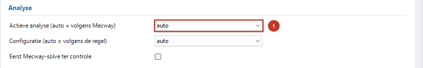
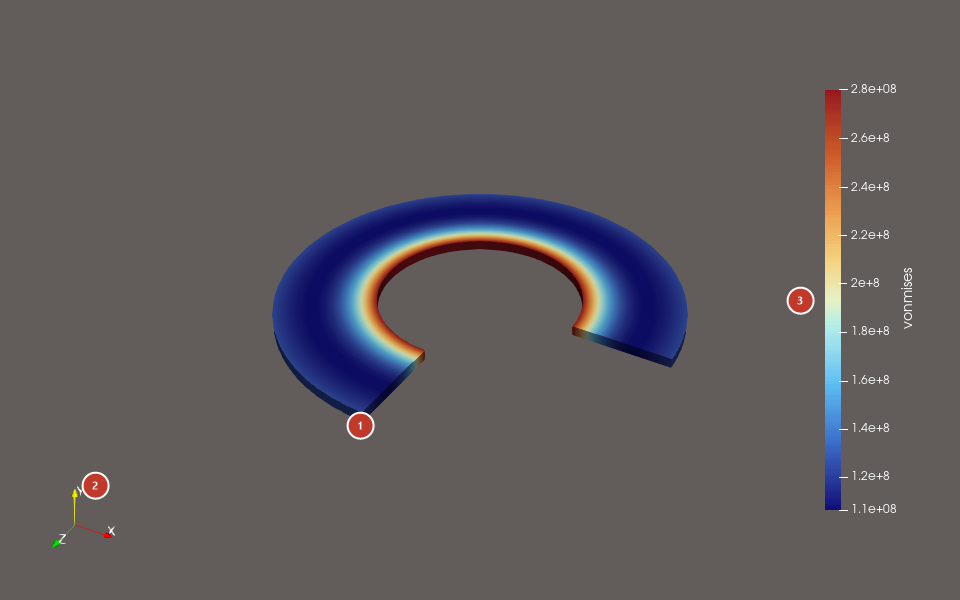
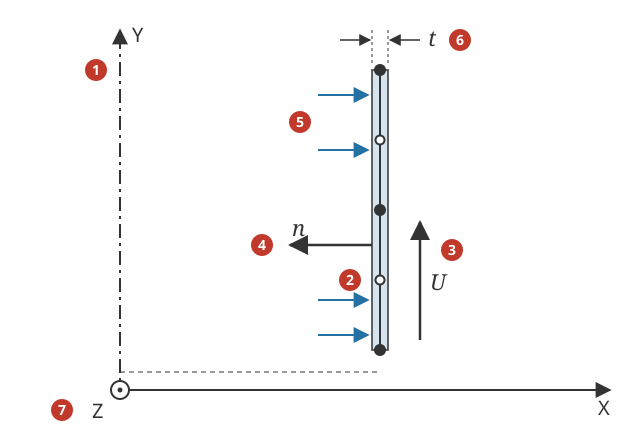
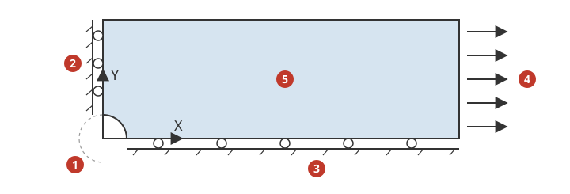
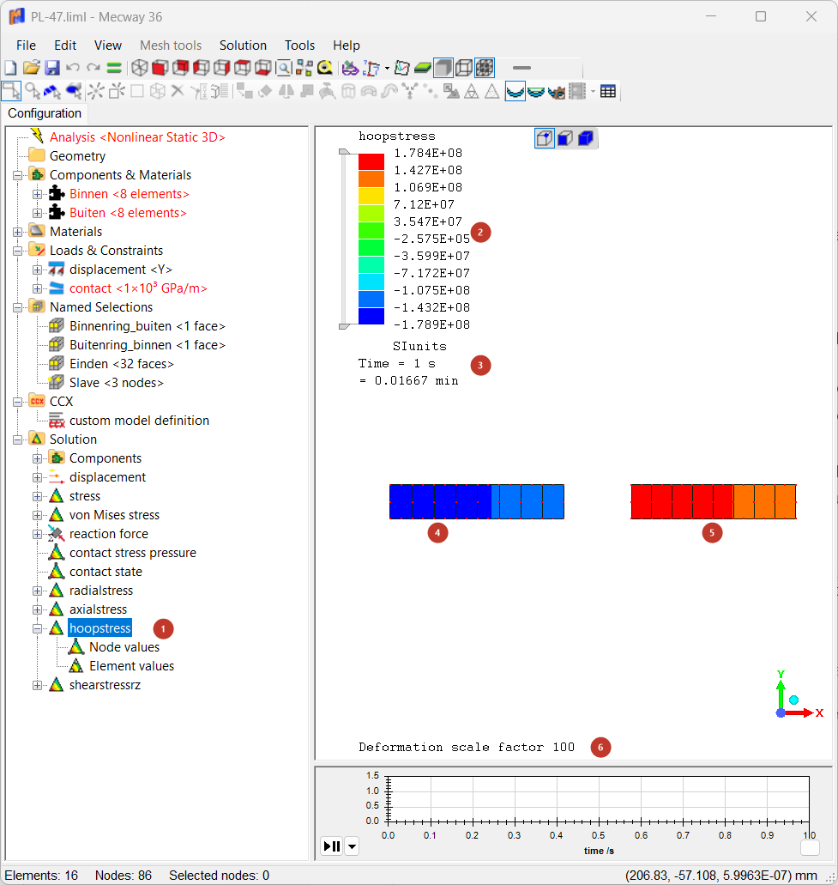

# 2D- en axisymmetrische analyses

*English version: [2D_and_axisymmetric.md](en/2D_and_axisymmetric.md)*

De bridge vertaalt de statische en dynamische 2D-analysetypen van Mecway naar
Code-Aster `MECA_STATIQUE` of `DYNA_NON_LINE` met vlakke elementen (U3.13.01
"Modélisations AXIS, D_PLAN, C_PLAN"):

| Mecway-analyse | Mecway-materiaal | Code-Aster | Resultaat in Mecway |
|---|---|---|---|
| Static 2D (S20) | *Shell/membrane* met een dikte | `C_PLAN` (vlakke spanning) | verplaatsing X, Y; spanning (σ_zz = 0); von Mises; reacties voor de dikte t |
| Static 2D (S20) | *Shell/membrane* met een dikte en *plane strain* | `D_PLAN` (vlakke rek) | als hierboven, σ_zz = ν(σ_xx + σ_yy) |
| Static Axisymmetric (SA0) | geen geometrie (isotroop materiaal) | `AXIS` | verplaatsing X (radiaal), Y (axiaal); spanning met `stresszz` = tangentiële spanning (hoop stress); reacties voor 360 graden |
| Dynamic Response 2D (D20), Dynamic Response Axisymmetric (DA0) | als S20 / SA0 | als S20 / SA0, in de tijd (§2.4) | als S20 / SA0 per uitvoertijd, plus snelheid en versnelling |
| Acoustic Resonance 2D (A20) | *Speed of sound* (een dikte telt niet) | `PHENOMENE='ACOUSTIQUE'`, `PLAN` (§4) | per mode de frequentie en het drukveld `pressure`, als A30 |
| Static 3D (S30), Nonlinear Static (L30) met line3-elementen en `**ASTER-PLANE AXIS` | isotroop elastisch; de dikte uit `**ASTER-SHELL`, *Shell/membrane* of *RectBar* | `COQUE_AXIS` (§1.4.2) | verplaatsing X, Y, rotatie `rotz`; reacties en `reactionmomz` voor 360 graden; von Mises per oppervlak, en met de resultaatvelden `shell_stresses`, `shell_forces`, `principal_stresses` de spanningen, snedekrachten en hoofdspanningen per oppervlak (§1.4.2) |

De bridge-analyse is `lin_static_3d` ("Statisch") voor S20 en SA0 en `dyna_impl_3d`
("Dynamisch (impliciet)") voor D20 en DA0: met *Actieve analyse (auto = volgens Mecway)*
= `auto` kiest de bridge die. Algemene werking van de bridge:
[`Handleiding.md`](Handleiding.md). Acoustic Resonance 2D (A20) gaat naar de akoestische holtemodes `acoustic_modes_3d` (§4). Mecway heeft geen thermisch 2D-type: een thermisch model in een vlak
maak je met schalen ([`Thermisch.md`](Thermisch.md)); axisymmetrisch warmtetransport: §1.4.1.


1. Mecway's Y-as: de symmetrieas (SA0, Code-Aster `AXIS`).
2. Mecway's X-as: de straal r; alle knopen bij X ≥ 0.
3. De vlakke elementen in het XY-vlak: een doorsnede van het lichaam.
4. Straal r van een punt: Code-Aster integreert per radiaal (r dθ), de bridge vermenigvuldigt krachten en reacties met 2π.
5. Tangentiële richting θ: `stresszz` is de tangentiële spanning σ_θ (hoop stress).
6. De ring die de elementen voorstellen (360 graden): Mecway's krachten en reacties gelden voor deze hele ring.


1. De vlakke elementen in het XY-vlak (Z = 0).
2. Dikte t: de *Shell/membrane*-dikte van het materiaal (S20); Mecway's krachten en reacties gelden voor de hele t, Code-Aster rekent per eenheid van dikte.
3. Een rand van de vlakke elementen (faceid 1..4): druk, traction en een randkracht werken op zo'n rand (randcellen `SEG2`/`SEG3`).
4. Een belasting op de rand, in het XY-vlak.
5. σ_zz, loodrecht op het vlak: 0 bij vlakke spanning (`C_PLAN`), ν(σ_xx + σ_yy) bij vlakke rek (`D_PLAN`).

## 1. Werkwijze stap voor stap

**Kies eerst de route.** Een 2D-model komt op een van twee manieren bij de bridge. De mesh is
dezelfde (vlakke elementen in het XY-vlak); de routes verschillen in het Mecway-analysetype en
in een regel tekst:

- **Route B: Mecway's eigen 2D-type.** *Static 2D* (S20), *Static Axisymmetric* (SA0),
  *Dynamic Response 2D* (D20) of *Dynamic Response Axisymmetric* (DA0). Alleen lineair. Geen
  extra regel. Mecway rekent hetzelfde model zelf, dus zijn eigen oplossing is een referentie
  (§5).
- **Route A: een 3D-type van Mecway op vlakke elementen.** *Nonlinear Static* (L30), *Static
  3D* (S30), *Thermal Steady State* (T30) of *Thermal Transient* (T31). In een 3D-type
  behandelt Mecway de vlakke elementen als shells, dus het materiaal heeft een geometrie
  *Shell/membrane* met een dikte nodig. Een regel in CCX > *Custom model definition*,
  `**ASTER-PLANE C_PLAN` (vlakke spanning), `**ASTER-PLANE D_PLAN` (vlakke rek) of
  `**ASTER-PLANE AXIS` (axisymmetrisch), laat de bridge elk element als dat 2D-element rekenen
  in plaats van als shell. Mecway's eigen solver negeert de regel en rekent shells.
  Warmtetransport in een vlak (T30/T31 zonder de regel) is al een thermisch 2D-model (`PLAN`).
- **Nooit allebei.** De regel in een S20-, SA0-, D20- of DA0-model is een ERROR (§1.6). Een
  model heeft een regel; die geldt voor alle elementen.


1. Route B: een 2D-analysetype van Mecway (S20, SA0, D20, DA0); de vlakke elementen zoals ze zijn, niets toevoegen.
2. Route A: een 3D-analysetype van Mecway (L30, S30, T30, T31) op dezelfde vlakke elementen in het XY-vlak (Z = 0); Mecway behandelt ze als shells.
3. De shell-dikte t (materiaalgeometrie *Shell/membrane*): Mecway heeft hem nodig in route A; `C_PLAN` en `D_PLAN` gebruiken hem als dikte (§2.2), `AXIS` negeert hem.
4. Het tekstveld CCX > *Custom model definition* in de outline-boom; het staat er als CCX de solver is in *Analysis settings* ([`ASTER_regels_voorbeelden.md`](ASTER_regels_voorbeelden.md) §1).
5. De regel `**ASTER-PLANE C_PLAN`, `**ASTER-PLANE D_PLAN` of `**ASTER-PLANE AXIS` in dat veld: de bridge rekent de shells als elementen in vlakke spanning, vlakke rek of axisymmetrisch.

**Keuzetabel.** Zoek de rij van wat je wilt rekenen; de rij geeft het Mecway-analysetype (in
*Analysis settings*), de route, de elementen en het materiaal, de regel en waar het staat
uitgelegd. "Voorbeeld n" is een uitgewerkt voorbeeld met een modelbestand in §1.5.

| Wat je wilt | Mecway-analysetype | Route | Elementen en materiaal | Regel in CCX > *Custom model definition* | Waar |
|---|---|---|---|---|---|
| Lineair statisch, vlakke spanning of vlakke rek, ook met een temperatuur (thermische spanning) | *Static 2D* (S20) | B | vlakke elementen; materiaal *Shell/membrane* met de dikte t, voor vlakke rek ook *plane strain* aangevinkt | geen | §1.1 … §1.3, §2.5 |
| Lineair statisch, axisymmetrisch, ook met een temperatuur | *Static Axisymmetric* (SA0) | B | vlakke elementen bij X ≥ 0 (Y = as); materiaal zonder geometrie | geen | §1.1 … §1.3, §2.5; voorbeeld 1 |
| Lineaire dynamica in de tijd | *Dynamic Response 2D* (D20) of *Dynamic Response Axisymmetric* (DA0) | B | zoals S20 / SA0, met een dichtheid; geen temperatuur | geen | §1.1, §2.4 |
| Akoestische holtemodes in 2D | *Acoustic Resonance 2D* (A20) | – | vlakke elementen; *Speed of sound* | geen | §4 |
| Plasticiteit, grote vervormingen, laststappen (tijdtabellen), vlakke spanning of vlakke rek | *Nonlinear Static* (L30) | A | vlakke shell-elementen in het XY-vlak; *Shell/membrane* met de dikte t; plasticiteit zoals in 3D | `**ASTER-PLANE C_PLAN` of `**ASTER-PLANE D_PLAN` | §1.4; voorbeeld 3 |
| Hetzelfde, axisymmetrisch | *Nonlinear Static* (L30) | A | vlakke shell-elementen bij X ≥ 0; *Shell/membrane* met een willekeurige dikte (telt niet) | `**ASTER-PLANE AXIS` | §1.4; voorbeeld 2 |
| Contact tussen delen (krimpverbinding, delen die elkaar raken), ook met wrijving | alleen *Nonlinear Static* (L30) | A | zoals de twee rijen hierboven, plus een *Contact* (unilateraal) tussen twee vlakselecties van randen | `**ASTER-PLANE C_PLAN`, `D_PLAN` of `AXIS` | §1.4 punt 6; voorbeeld 4 |
| Lineair statisch als 3D-model (bijv. om te vergelijken met Mecway's eigen shell-solve) | *Static 3D* (S30) | A | zoals bij L30; geen contact | `**ASTER-PLANE C_PLAN` (nagelopen, PL-33); `D_PLAN` en `AXIS` volgen dezelfde route, niet nagelopen in S30 | §1.4; voorbeeld 3 |
| Warmtetransport in een vlak | *Thermal Steady State* (T30) of *Thermal Transient* (T31) | – (thermisch 3D-type, geen regel) | vlakke shell-elementen; de shell-dikte telt mee | geen (de bridge rekent `PLAN`) | [`Thermisch.md`](Thermisch.md) |
| Warmtetransport, axisymmetrisch | T30 of T31 | A | vlakke shell-elementen bij X ≥ 0; *Shell/membrane* met een willekeurige dikte; *Thermal conductivity* (T31 ook *Specific heat* en *Density*) | `**ASTER-PLANE AXIS` | §1.4.1; voorbeeld 5 |
| Thermische spanning uit een axisymmetrisch warmtetransport (keten thermisch -> mechanisch) | *Thermal Transient* (T31) met *Thermal stress* | A | zoals de rij hierboven, plus E, ν, *Thermal expansion* en opleggingen; plasticiteit zoals in L30 | `**ASTER-PLANE AXIS` | §1.4.1; voorbeeld 6 |
| De keten thermisch -> mechanisch in vlakke spanning of vlakke rek | *Thermal Transient* (T31) met *Thermal stress* | A | vlakke shell-elementen in het XY-vlak; *Shell/membrane* met een dikte t voor het hele model; thermische en mechanische eigenschappen zoals hierboven | `**ASTER-PLANE C_PLAN` of `D_PLAN` | §1.4.1 |
| Axisymmetrische schalen (een dunne omwentelingswand, lijnelementen), lineair | *Static 3D* (S30) of *Nonlinear Static* (L30) | A | line3-elementen in het XY-vlak bij X ≥ 0; isotroop elastisch; de dikte uit de regel, *Shell/membrane* of *RectBar* | `**ASTER-PLANE AXIS` en `**ASTER-SHELL <materiaal>: EPAIS=<t>` | §1.4.2; voorbeeld 7 |
| Niet-lineaire dynamica, modes, knik in 2D | – | – | – | niet mogelijk | §3 |

Waar typ je de regel: Mecway rekent L30 alleen met CCX; kies CCX ook voor S30, T30 en T31 als
solver in *Analysis settings*, dan staat de tak CCX met *Custom model definition* in de
outline-boom. Het veld van een andere solver werkt ook, met het voorvoegsel van die solver:
`#ASTER-PLANE` in een OpenRadioss-veld, `$ASTER-PLANE` in een Mystran-veld
([`ASTER_regels_voorbeelden.md`](ASTER_regels_voorbeelden.md) §1); `-VLAK` is de Nederlandse
spelling (`**ASTER-VLAK AXIS`). De bridge leest de regel welke solver er ook gekozen is.

### 1.1 In Mecway: het model (route B)

1. **Analysetype.** *Static 2D*, *Static Axisymmetric*, *Dynamic Response 2D* of
   *Dynamic Response Axisymmetric* in de analyse-instellingen (dynamisch: *Time period*,
   *Time step size* en *Generate solution every n time steps*; geen *Mode
   superposition*).
2. **Mesh.** Vlakke elementen tri3, tri6, quad4 of quad8 in het XY-vlak, alle knopen met
   Z = 0 (Mecway negeert Z; de bridge stopt als Z ≠ 0, §3). Axisymmetrisch: Y is de
   symmetrieas, X de straal, alle knopen met X ≥ 0 (Mecway Ltd., 2026, §6.1.3, §7.2).
   Kwadratische elementen mogen gekromde randen hebben (middenknoop naast de koorde).
3. **Materiaal.**
   - S20: geef het materiaal een geometrie *Shell/membrane* met een **dikte** t; voor
     vlakke rek ook *plane strain* aanvinken. Zonder dikte rekent Mecway niet en stopt
     de bridge (§3). Het hele model heeft een dikte en een type (vlakke spanning of
     vlakke rek), anders stopt de bridge.
   - SA0: geen geometrie. Een dikte telt niet (de bridge negeert hem met een WARNING;
     Mecway's eigen solve geeft dan geen oplossing).
   - Dichtheid voor zwaartekracht, centrifugaalkracht en dynamica.
4. **Opleggingen.** *Fixed support*, *Pinned support* en *Displacement* langs X of Y op
   knopen of op randen (vlakselectie van randen, faceid 1..4), *Symmetry* met normaal X
   of Y op randen. Axisymmetrisch: Mecway vraagt een oplegging in X op knopen op de as
   (X = 0) (Mecway Ltd., 2026, §7.2); doe dat ook voor de bridge (zonder NIET
   geverifieerd). Een oplegging in Y is nodig tegen starre beweging langs de as.
5. **Belastingen** (alle waarden zoals in Mecway, zie §2.2):
   - *Pressure* en *Traction* op randen;
   - *Force* op knopen (totaal, gelijk per knoop) of op randen (totaal, uniform over het
     randoppervlak);
   - *Gravity* in het XY-vlak (SA0: alleen langs Y);
   - *Centrifugal force* om Z (S20) of om Y (SA0);
   - S20 en SA0: *Thermal stress* met *Temperature* (op knopen, randen of elementen) of
     *Node temperature*, en de uitzettingscoëfficiënt in het materiaal (§2.5).
   Waarden mogen een tijdtabel zijn (dynamica). Dynamica: *Rayleigh damping* op het hele
   model. Andere items stoppen of worden overgeslagen met een ERROR (§3, §4).

### 1.2 In het hoofdvenster van de bridge



1. *Actieve analyse (auto = volgens Mecway)*: `auto` (of `lin_static_3d`; voor D20/DA0
   `dyna_impl_3d`).

*Actieve analyse (auto = volgens Mecway)* `auto` (of `lin_static_3d`). De instellingen
van de pagina Statisch of Dynamisch (impliciet) gelden zoals in 3D; voor D20/DA0 gelijk
aan Mecway: *Tijdschema (SCHEMA_TEMPS)* `NEWMARK`, `deformation` `PETIT` en
*Rekenstappen per Mecway-tijdstap* = 1 (standaard; §2.4). De
resultaatvelden `strain` en `shell_*`
geven niets in 2D; `principal_stresses` geeft `principal1..3` en `tresca` zoals Mecway
(eigenwaarden van de 3D-tensor met σ_zz, per elementknoop, knoop = gemiddelde). De
foutschatter wordt in 2D niet gebruikt (INFO).

### 1.3 De resultaten in Mecway bekijken

De resultaten hebben Mecway's eigen namen en staan onder dezelfde items als Mecway's
eigen S20/SA0-oplossing (gemeten: Mecway voegt *displacement*, *stress*, *von Mises
stress*, *reaction force*, *principal stress* en *Tresca stress* toe als het het
resultaat opent):

| Mecway-variabele | Code-Aster | Betekenis |
|---|---|---|
| `displx`, `disply`, `displmag` | `DEPL` DX, DY | X, Y (SA0: radiaal, axiaal); geen `displz` (zoals Mecway) |
| `stressxx`, `stressyy`, `stressxy` | `SIGM_NOEU`/`SIGM_ELNO` | spanningen in het vlak (SA0: σ_r, σ_z, τ_rz) |
| `stresszz` | `SIGM_*` SIZZ | 0 bij vlakke spanning, ν(σ_xx + σ_yy) bij vlakke rek, **tangentiële spanning** in SA0 |
| `stressyz`, `stresszx` | – | 0 (zoals Mecway) |
| `radialstress`, `axialstress`, `hoopstress`, `shearstressrz` | `SIGM_*` SIXX, SIYY, SIZZ, SIXY | alleen axisymmetrisch (SA0, DA0, route A met `AXIS`, de thermische `AXIS`-keten): σ_r, σ_z, σ_θ, τ_rz onder een eigen naam, dezelfde waarden als `stressxx`, `stressyy`, `stresszz`, `stressxy` (namen van de bridge; route `liml`; een eigen resultaatformule met een van deze namen vervangt hem) |
| `vonmises` | `SIEQ_*` | 3D-von Mises met σ_zz |
| `reactionforcex/y/mag` | `REAC_NODA` × t of × 2π | voor de hele dikte (S20) of 360 graden (SA0), zoals Mecway |
| `contactpressure`, `contactstate` | `LAGS_C`, `CONT_NOEU` | route A met contact (§1.4): op elke knoop van het model, 0 buiten het contact (een 3D-model heeft ze alleen op de slaveknopen); het minimum per component is dus 0, en een resultaatformule met `contactpressure` wordt op elke knoop berekend |

Axisymmetrische schalen hebben eigen namen per oppervlak (§1.4.2).

**De assen.** Mecway tekent de doorsnede, niet het omwentelingslichaam: X is de straal en Y de
symmetrieas (axisymmetrisch), Z de omtreksrichting; bij vlakke spanning en vlakke rek liggen X
en Y in het vlak en is Z de dikterichting. Route A (§1.4) tekent de vlakke elementen als een
dunne vlakke plaat in het 3D-beeld, axisymmetrische schalen (§1.4.2) als de lijn van de
meridiaan. Draai het beeld zodat je langs Z kijkt (Z naar je toe) om de doorsnede te zien zoals in de
figuren van deze pagina. Voor een beeld van het hele lichaam: de knop ParaView (hieronder).

**Rood in Mecway's boom is normaal.** Gezien in het venster van Mecway 35 (17 nov 2026): in
een model van route A met contact (PL-40) zijn de analyse, de componenten en het contact rood;
in modellen met axisymmetrische schalen (PL-60, PL-62) het component, de druk en de symmetrie.
Rood markeert wat Mecway's eigen solver niet zou rekenen (oorzaak NIET geverifieerd; Mecway's
handleiding §7.5 noemt line3-balken alleen bij de CCX-solver). Het is onschuldig: de bridge
rekent deze onderdelen wel.

**Omwentelingsbeeld in ParaView.** Met *VTU/PVD-bestanden voor ParaView* (`vtu_export`) aan
schrijft de bridge `<model>_<run-id>_paraview_axis.py` naast het resultaat van een
axisymmetrische run, en de knop ParaView (Resultatenvenster en convergentievenster,
[`Handleiding.md`](Handleiding.md) §5.1) opent het resultaat als omwentelingslichaam: de
doorsnede 270 graden gedraaid om Y, zodat het uitgesneden deel de doorsnede laat zien.



1. Het snijvlak: de doorsnede zoals Mecway hem tekent (X = straal).
2. De Y-as van ParaView's oriëntatieassen: de richting van de symmetrieas.
3. De kleurschaal op de laatste tijdstap: `vonmises` (axisymmetrische schalen `vonmisesu1`, een thermische run `temperature`, anders `displmag`); kies een andere variabele in de werkbalk van ParaView.

De vectoren (`displx`, `disply`, `DEPL`) worden gekopieerd, niet meegedraaid: `displx` blijft de
radiale verplaatsing van de doorsnede, dus ParaView's *Warp By Vector* op het
omwentelingslichaam klopt niet. Zonder `vtu_export` (alleen *MED-bestand voor ParaView*), en bij een run waarvan de knop het
MED-bestand voorrang geeft (`_xfem.rmed`), opent de knop de doorsnede plat, zoals voorheen.

### 1.4 Niet-lineair in 2D: een 3D-model met `**ASTER-PLANE` (route A)

Mecway heeft geen niet-lineair 2D-type. Voor plasticiteit, grote vervormingen, tijdstappen,
lastopbouw en contact in 2D maak je het model als 3D-model van vlakke elementen en zeg je de
bridge met een regel het in 2D te rekenen (voorbeelden 2, 3 en 4 in §1.5):

1. **Analysetype.** *Nonlinear Static* (L30) in *Analysis settings*, met CCX als solver
   (Mecway rekent L30 alleen met CCX). *Static 3D* (S30) kan ook (lineair, zoals S20; geen
   contact).
2. **Mesh.** Vlakke elementen tri3, tri6, quad4 of quad8 in het XY-vlak (Z = 0), verder
   niets (geen balken, truss, veren of volume-elementen; alleen line3-elementen: §1.4.2); in
   een 3D-type behandelt Mecway ze als shells. Axisymmetrisch: Y is de as, X de straal, alle knopen bij X ≥ 0 (eerste
   figuur).
3. **Materiaal.** Een geometrie *Shell/membrane* met een dikte (Mecway heeft hem nodig voor
   shells). Voor `C_PLAN` en `D_PLAN` is het de dikte t: Mecway's krachten en de reacties
   gelden voor t (§2.2). Voor `AXIS` een willekeurige waarde: hij telt niet (INFO). Alle
   elementen hebben dezelfde dikte. Plasticiteit (*Bilinear isotropic*, *Stress-strain
   curve*) zoals in 3D.
4. **De regel.** In CCX > *Custom model definition* een regel:

   ```
   **ASTER-PLANE C_PLAN
   ```

   met `C_PLAN` (vlakke spanning), `D_PLAN` (vlakke rek) of `AXIS` (axisymmetrisch). Schrijf
   het streepje: `**ASTER PLANE AXIS` (met een spatie) is een ERROR (§1.6). Mecway's eigen
   solver negeert de regel; de bridge rekent dan elke elset met die modelisatie in plaats van
   als shells (een vinkje *plane strain* op het materiaal telt dan niet; WARNING als het de
   regel tegenspreekt). Andere velden en voorvoegsels: zie "Waar typ je de regel" in §1.
5. **Opleggingen en belastingen** op knopen en op randen, zoals in §1.1. Een rand is een
   vlakselectie van randen van de vlakke elementen (faceid 1..4, figuur bij voorbeeld 4);
   een vlakselectie van de elementvlakken (faceid 5/6) geeft een ERROR ("alleen randen van
   vlakke elementen (faceid 1..4), hier shellface", §1.6). Opleggingen die alleen Z of
   rotaties vasthouden (*Node rotation*, een *Displacement* nul langs Z, een *Symmetry* met
   normaal Z: vaak aanwezig voor Mecway's eigen shell-solve) vallen weg met een INFO.
   *Thermal stress* met *Temperature* en *Node temperature* zoals in §2.5, ook als tijdtabel
   (PL-34, PL-36; Mecway's eigen CCX-solve van de shells geeft de helft van de thermische
   uitzetting, KNOWN_BUGS 139).
6. **Contact** (alleen L30): een *Contact* (unilateraal) tussen twee vlakselecties van randen
   van de vlakke elementen: de master-rand en de slave-rand (figuur en stappen: voorbeeld 4;
   welke kant master is: [`Instellingen_contact_en_nietlineair.md`](Instellingen_contact_en_nietlineair.md) §3.2).
   De bridge schrijft ze als randcellen (`SEG2`/`SEG3`) voor `DEFI_CONTACT` met de
   instellingen van de pagina Niet-lineair statisch, zoals in 3D. Overlappende geometrie (een
   krimpverbinding) wordt in de eerste stap opgelost. Het resultaat `contactpressure` is een
   druk (geen factor t of 2π). Nagelopen in `AXIS` en `D_PLAN` (krimpverbinding,
   Hertz-lijncontact, een Code-Aster-testcase) en met Coulomb-wrijving (een blok dat over een
   blok glijdt); `C_PLAN` rekent (alleen nagelopen met ν = 0). Met wrijving kunnen
   slave-knopen die een andere oplegging langs de contactrand vasthoudt Code-Aster laten
   stoppen met een singuliere matrix: de bridge geeft dan een WARNING; laat die knopen weg met
   een knoopselectie en `**ASTER-ZONE SANS_GROUP_NO='<<selectie>>'` (KNOWN_BUGS 141).
   *Bonded* contact in 2D kan niet: een ERROR, de bridge stopt (haal het weg of reken het
   model in 3D). Of Mecway's venster shell-randen laat kiezen voor een
   contact is NIET nagelopen.
7. **Bridge.** *Actieve analyse (auto = volgens Mecway)* `auto` (→ `nonlin_static_3d` voor
   L30, `lin_static_3d` voor S30). Controleer in de log dat de regel gelezen is: per elset
   `INFO: Elset '…' -> MODELISATION='C_PLAN', thickness … m (Mecway L30).` (bij `AXIS` zonder
   de dikte) en een keer `INFO: 2D analysis L30: MODELISATION='…'; concentrated forces / …
   and reactions x … (…).` Zonder deze regels heeft de bridge de elementen als shells
   gerekend (de regel ontbreekt of staat in een veld dat de bridge niet leest).

De bridge-analyse is `nonlin_static_3d` (L30) of `lin_static_3d` (S30); de instellingen van
de pagina Niet-lineair statisch gelden zoals in 3D. *deformation* `GROT_GDEP` (de standaard)
wordt `GDEF_LOG` voor plastisch materiaal (`SIMO_MIEHE` als gekozen, alleen in
`D_PLAN`/`AXIS`) en `GREEN_LAGRANGE` voor elastisch materiaal; een druk is dan een
meebewegende belasting zoals in 3D. De plasticiteitswetten van de bridge kennen `C_PLAN`
zelf (catalogus Code-Aster 17.4). Resultaten per stap zoals in §1.3, plus
`plasticstrainxx/yy/zz/xy` en `equivalentplasticstrain`; de reactiekrachten met de factor t
of 2π in elke stap (PL-30, PL-32). Verificatie PL-30 … PL-36: een dikwandige cilinder met ideale
plasticiteit (Hill) in `D_PLAN` en `AXIS`, eerste vloei bij een gat in `C_PLAN`,
Code-Aster-testcase ssnp159b (`AXIS`, `GDEF_LOG`) door de bridge. NIET meegenomen:
verlijmd contact (ERROR), de keten thermisch -> mechanisch (warmtetransport zelf en de keten:
§1.4.1).

**Bezwijken van elementen in 2D.** `#ASTER-BEZWIJKEN` (en de andere bezwijkgrenzen van
[`Bezwijken.md`](Bezwijken.md)) werkt in route A in *Nonlinear Static* (L30) met `C_PLAN`,
`D_PLAN` en `AXIS`, zoals in 3D: een element waarvan de gemiddelde plastische rek de grens
haalt, krijgt een zacht materiaal, en de elementvariabele `failed` verbergt het vanaf de
volgende stap. Nagelopen (Code-Aster 17.4, PL-70 … PL-74): de bezwijkstap van de gesloten
oplossing, alleen de elementen met een grens, de last daarna gedragen door de andere
elementen. Gemeten: `PETIT`, `PETIT_REAC` en `GDEF_LOG` in alle drie, `SIMO_MIEHE` in
`D_PLAN` en `AXIS`, alle met *Bilinear isotropic*; een verstevigingskromme (`AXIS`),
kinematische versteviging bij afschuiving (`C_PLAN`, `PETIT`) en bij trek (`AXIS`,
`GDEF_LOG`). Andere combinaties gebruiken dezelfde lus (NIET een voor een nagelopen). Niet
samen met contact in hetzelfde model, niet op axisymmetrische schalen en niet in Mecway's
2D-typen (D20/DA0): een WARNING, de elementen bezwijken niet. `C_PLAN` met grote rek
(`GDEF_LOG`, de standaard voor plastisch materiaal, of `PETIT_REAC`): de dikte volgt de rek
niet, dus krachten en reacties zijn bij eenassig plastisch vloeien ongeveer √(1 + ε) te hoog
(+1,07% bij 2,2% rek, KNOWN_BUGS 144), ook zonder bezwijken. De bridge waarschuwt alleen bij
een bezwijkgrens boven 0,05. Grote plastische rek: gebruik `D_PLAN`, `AXIS` of 3D.

Contact: PL-40 … PL-46 (een krimpverbinding binnen 0,01% van Lamé, Hertz-lijncontact, een
Code-Aster-testcase, wrijving). Het
openen van zo'n resultaat in het Mecway-venster is NIET nagelopen (een test in de
Mecway-GUI moet nog).

### 1.4.1 Warmtetransport axisymmetrisch

Mecway heeft geen axisymmetrisch thermisch type; de bridge rekent het uit de thermische
3D-typen (route A). Warmtetransport in een vlak heeft geen regel nodig: vlakke
shell-elementen in T30 of T31 zijn al een thermisch 2D-model (`PLAN`,
[`Thermisch.md`](Thermisch.md)), de schaaldikte telt mee. Uitgewerkte voorbeelden: voorbeeld 5
(warmtetransport) en voorbeeld 6 (de keten) in §1.5.

1. **Analysetype.** *Thermal Steady State* (T30) of *Thermal Transient* (T31) in *Analysis
   settings*, solver CCX (voor het veld van stap 4).
2. **Mesh.** Vlakke shell-elementen tri3, tri6, quad4 of quad8 in het XY-vlak (Z = 0),
   alle X ≥ 0; Y is de symmetrie-as, X de straal.
3. **Materiaal.** *Shell/membrane* met een dikte (Mecway vraagt hem; in `AXIS` telt hij niet
   mee), *Thermal conductivity*, voor T31 ook *Specific heat* en *Density*.
4. **De regel.** In CCX > *Custom model definition* een regel `**ASTER-PLANE AXIS`
   (schrijfwijzen als in §1.4). Zonder die regel blijven de schalen een `PLAN`-model;
   `C_PLAN` of `D_PLAN` in T30/T31 geven alleen een INFO dat de regel niet nodig is (in T31 met
   *Thermal stress* kiezen ze vlakke spanning of vlakke rek voor de keten hieronder).
5. **Lasten** op de randen van de elementen (faceid 1..4) en op de elementen:
   *Temperature*, *Heat flux*, *Convection*, *Radiation*, *Internal heat generation*,
   *Heat flow*, ook als tijdtabel en op dezelfde manier als in 3D
   ([`Thermisch.md`](Thermisch.md); *Internal heat generation* en een *Heat flow* op
   elementen nagelopen: PL-56, PL-57). T31: een begintemperatuur (zoals in 3D).
6. **Bridge.** *Actieve analyse (auto = volgens Mecway)* `auto` (→ `ther_3d`, pagina
   Thermisch). De log toont `INFO: T30 (of T31) with '#ASTER-PLANE
   AXIS': thermal MODELISATION='AXIS' about Y (per radian in Code-Aster, 360 degrees in
   Mecway).` en per elset `INFO: Elset '…' -> thermal MODELISATION='AXIS' (the shell
   thickness does not count).`

Wat de bridge doet: de elsets worden thermisch `MODELISATION='AXIS'` om Y. Code-Aster rekent
per radiaal, de temperatuur hangt daar niet van af. Factoren:

- Een last per oppervlak (*Heat flux*, *Convection*, *Radiation*, *Temperature* op een rand)
  en per volume (*Internal heat generation*) heeft geen factor nodig, en de schaaldikte
  telt niet mee.
- Een totale *Heat flow* (W, voor de hele 360 graden) op een rand wordt gedeeld door het
  omwentelingsoppervlak 2π ∫ r dl van die rand, op elementen door het omwentelingsvolume,
  en daarna als hierboven toegepast.
- Resultaten als in 3D: `temperature`, `heatfluxx` = radiale en `heatfluxy` = axiale flux
  (W/m²).

NIET vertaald (een ERROR-regel "Niet vertaald: …", de berekening gaat zonder die last door):
lasten op het vlak van de doorsnede (faceid 5/6: in `AXIS` is er geen oppervlak) en een
*Heat flow* op knopen (gebruik een heat flow op een rand). Een *Thermal stress* in T30 heeft
geen effect (de keten vraagt T31), zoals in 3D. Geweigerd met een ERROR in `AXIS` (de bridge
stopt): `#ASTER-LASBRON` (lassen), `#ASTER-METALLURGIE` en *Bonded* contact. Knopen bij
X < 0 geven de ERROR van §1.6. De letterlijke meldingen: §1.6.

**Thermal stress (keten, T31).** Een *Thermal Transient*-model (T31) met een *Thermal stress* en
de regel `**ASTER-PLANE AXIS` wordt gerekend als de keten van [`Lassen.md`](Lassen.md) §9: eerst
de thermische stappen (`THERMIQUE` `AXIS`, hierboven), daarna `STAT_NON_LINE` met het
temperatuurveld van elke stap als belasting, ook `AXIS` (steunen en lasten zoals in route A van
§1.4; de reacties gelden voor 360 graden, `stresszz` is de tangentiële spanning). In Mecway,
naast de stappen 1 tot 6:

7. **Materiaal**: ook *Young's modulus*, *Poisson's ratio* en *Thermal expansion coefficient*.
8. **Opleggingen en mechanische lasten** op randen of knopen, zoals in §1.4 (minstens een
   oplegging in Y tegen starre beweging langs de as). Biedt Mecway *Displacement* en *Thermal
   stress* alleen in een mechanisch analysetype aan: [`Lassen.md`](Lassen.md) §9.1 stap 4.
9. ***Thermal stress*** met de begintemperatuur als *Reference temperature*.

De log toont dan ook `INFO: T31: the mechanical part of the thermomechanical chain as
MODELISATION='AXIS' (reactions x 2 pi).` Een plastisch materiaal (zoals in L30) werkt in de
keten: PL-78 (een ring die gelijkmatig 200 K opwarmt, einden vast, bilineair isotroop) geeft de
gesloten oplossing voor de axiale spanning, de plastische rek, u_r en de reactie (alle binnen
1e-6).

**De keten in vlakke spanning of vlakke rek.** Hetzelfde T31-model in het XY-vlak met de regel
`**ASTER-PLANE C_PLAN` of `**ASTER-PLANE D_PLAN` (in plaats van `AXIS`; X < 0 mag): het
thermische deel blijft het 2D-model `PLAN` (de shell-dikte telt voor een *Heat flow* in W), het
mechanische deel wordt `C_PLAN` of `D_PLAN` met de dikte t zoals in §1.4 (krachten / t,
reacties × t). Alle elsets hebben dezelfde dikte nodig (anders een ERROR). De log toont
`INFO: T31: the mechanical part of the thermomechanical chain as MODELISATION='C_PLAN'
(concentrated forces / 0.001, reactions x 0.001: per unit thickness in Code-Aster, thickness t
in Mecway).` (hier t = 1 mm) Nagelopen (PL-75 … PL-80): een strook met een lineaire temperatuur en beide einden
vast (σ_xx = −E α ΔT, in `D_PLAN` /(1 − ν), en σ_zz), met een druk, een kracht in N en een
warmtestroom in W op een rand (2 mm dik), en met plasticiteit: alle binnen 1e-6 van de
gesloten oplossing.

ERROR in de keten (`AXIS`, `C_PLAN`, `D_PLAN`): contact, koppelingen tussen knoop en oppervlak,
verlijmd contact en een beginsnelheid. Een bezwijkgrens (`#ASTER-BEZWIJKEN`) geeft een
WARNING: de keten heeft geen bezwijklus, de elementen bezwijken niet (ook in 3D). Puntmassa's
worden met een INFO genegeerd; vergelijkingen tussen vrijheidsgraden, flexibele verbindingen
en element offsets slaat de lezer al met een WARNING over (geen ERROR van de keten). In `AXIS`
(met of zonder keten) en in de keten met `C_PLAN` of `D_PLAN` geeft ook `#ASTER-LASBRON`
(lassen), `#ASTER-METALLURGIE` en verlijmd contact een ERROR.
Nagelopen: PL-58 (de dikwandige buis van PL-24 als T31, 10 stappen van 2000 s, θ = 1,
stationair): gelijk aan PL-24 (dezelfde buis met de exacte ln-temperatuur in de knopen,
MECA_STATIQUE) binnen 1,0e-6 (u_r aan beide wanden en de axiale reactie); tegen de gesloten
vorm u_r 1,5e-5, σ_θ +0,66% en +0,13%, σ_z +0,11% en +0,36%, σ_r −1,04% (tolerantie 1,2%, als
PL-24), de stationaire temperatuur in het midden 1e-8 K; de axiale reactie 2π α E ∫ θ r dr
(factor 2π) 9e-7. PL-59 is PL-58 met een inwendige druk van 50 MPa op de binnenrand (een
randbelasting in de keten): u_r(a) tegen de thermische oplossing plus de Lamé-oplossing in
vlakke rek 6,8e-6, de axiale reactie 9,5e-7.

Nagelopen (Code-Aster 17.4, PL-50 … PL-57, [`Verificatie.md`](Verificatie.md) §2D en
axisymmetrisch): radiale geleiding in een buis, een totale warmtestroom op de binnenrand,
convectie en straling op de buitenrand, transiënte afkoeling van een volle cilinder tegen de
Besselreeks, een volle cilinder met *Internal heat generation* (PL-56) en met dezelfde warmte
als totale *Heat flow* op de elementen (PL-57), alles binnen 0,7% van de gesloten vorm (de stationaire gevallen binnen 0,1 K of
0,5%), en vlakke schalen met convectie zonder de regel exact. Mecway heeft geen
axisymmetrisch thermisch type, dus er is geen Mecway-referentie; de Code-Aster-testcase tpla01
is vervangen door deze gesloten-vorm-gevallen.

### 1.4.2 Axisymmetrische schalen (line3, `COQUE_AXIS`)

Een dunwandig omwentelingslichaam (een buis, een vat, een ronde plaat) kan als schaal langs
zijn meridiaan gerekend worden: line3-elementen in het XY-vlak, Y de as en X de straal,
worden Code-Aster's axisymmetrische schaal `COQUE_AXIS` (route A, STAPPENPLAN S44e).
Uitgewerkt voorbeeld: voorbeeld 7 in §1.5.



1. Mecway's Y-as: de symmetrieas; X is de straal, alle knopen bij X ≥ 0.
2. Een line3-element op het middenvlak van de wand: knoop 1, middenknoop, knoop 2 (Mecway's volgorde); hier zit knoop 1 boven.
3. U: van knoop 1 naar knoop 2 van het element; hier naar beneden.
4. n = Z × U (Mecway's standaard-V-as van het element). Voor een keten die naar beneden getekend is (U = −Y) bij X > 0 wijst hij van de as af.
5. Een positieve *Pressure* op faceid 1 (de zijkant van een lijnelement) duwt langs n, precies zoals Mecway de pijlen tekent: op het vlak tegenover n, wijzend langs n. Hier naar buiten: een inwendige druk.
6. De wanddikte t, gecentreerd op de lijn van de knopen.
7. Mecway's Z-as, uit de tekening.
8. Het bovenoppervlak (resultaten `…u1`): het vlak met de drukpijlen, tegenover n.
9. Het onderoppervlak (resultaten `…b`, `…b1`): het vlak aan de andere kant.

1. **Analysetype.** *Static 3D* (S30) of *Nonlinear Static* (L30, solver CCX).
2. **Mesh.** Alleen line3-elementen in het XY-vlak (Z = 0), alle knopen bij X ≥ 0; geen
   vlakke elementen in hetzelfde model, geen line2 (ERROR, §1.6). De richting van de elementen
   bepaalt de kant van een druk (figuur): teken een keten in een richting; buren die de andere
   kant op lopen geven een WARNING.
3. **Materiaal.** Isotroop elastisch: E, ν, een dichtheid voor zwaartekracht. Plasticiteit,
   een hyperelastisch of een orthotroop materiaal: ERROR.
4. **De regels.** In CCX > *Custom model definition*:

   ```
   **ASTER-PLANE AXIS
   **ASTER-SHELL Staal: EPAIS=5 mm
   ```

   `**ASTER-SHELL <materiaal>: EPAIS=<dikte>` geeft de dikte van de schalen van dat
   materiaal, in m of met `mm`, `cm`, `m`; eventueel `, A_CIS=<waarde>` (de
   afschuifcoëfficiënt, zonder de standaard 5/6 van Code-Aster). Nederlandse spelling:
   `**ASTER-SCHAAL`. De materiaalnaam is alles voor de laatste dubbele punt. Zonder de regel
   neemt de bridge de dikte uit de geometrie *Shell/membrane* van het materiaal, of uit een
   *RectBar*: de maat a (langs Mecway's V-as, die standaard in het XY-vlak ligt; b als V langs
   Z staat). Allebei aanwezig: de regel telt (INFO, of een WARNING als de waarden verschillen).
   Meerdere regels voor een materiaal: de laatste telt. Helemaal geen dikte: ERROR.
5. **Opleggingen** op knopen (knoopselectie) of op de elementuiteinden (faceid 2 = knoop 1,
   faceid 3 = knoop 2): *Fixed support* houdt X, Y en de rotatie om Z vast (een inklemming);
   *Pinned support* X en Y; *Displacement* langs X of Y; *Node rotation* om Z; *Symmetry* met
   normaal X of Y houdt ook de rotatie om Z vast (een knoop op de as: normaal X; een
   symmetrievlak Y = constant: normaal Y). Een knoop op de as (X = 0) zonder X en de rotatie
   om Z vast: WARNING. Een oplegging in Y tegen beweging langs de as.
6. **Belastingen.** *Pressure* op faceid 1 van de lijnelementen (de kant zoals in de figuur;
   een waarde of een tijdtabel); *Force* en *Moment* (om Z) op knopen of elementuiteinden, het
   totaal van de hele ring (360 graden, zoals de krachten van §2.2); *Gravity* langs Y. Niet
   vertaald: traction, een kracht op faceid 1, een druk met een formule in x, y, z, line
   pressure, centrifugaalkracht, temperaturen en contact (§1.6).
7. **Bridge.** *Actieve analyse (auto = volgens Mecway)* `auto` (→ `lin_static_3d` of
   `nonlin_static_3d`). De log toont per elset
   `INFO: Elset '…' -> MODELISATION='COQUE_AXIS' (axisymmetric shell, SEG3), thickness … m
   (Mecway S30).` en een keer `INFO: 2D analysis S30: axisymmetric shells (COQUE_AXIS) about Y;
   …`. In L30 rekenen de schalen met kleine verplaatsingen (`deformation` anders dan `PETIT`:
   WARNING; Code-Aster raadt het bijwerken van de geometrie van `COQUE_AXIS` af).

**Resultaten in Mecway.**

| Mecway-variabele | Betekenis | Resultaatveld (startscherm) |
|---|---|---|
| `displx`, `disply`, `displmag` | radiale en axiale verplaatsing | `displacements` |
| `rotz` | de rotatie om Z, rechtsom: positief draait X naar Y | `displacements` |
| `reactionforcex`, `reactionforcey`, `reactionforcemag`, `reactionmomz`, `reactionmommag` | de reacties voor 360 graden (× 2π); `reactionmommag` = \|`reactionmomz`\| | `reactions` |
| `vonmisesu1`, `vonmisesm`, `vonmisesb` | von Mises op het bovenoppervlak, het middenvlak en het onderoppervlak (knoopwaarden) | `vonmises` |
| `stressxxu1` … `stresszxu1`, `…m1`, `…b1` | de spanningstensor per oppervlak in globaal X, Y, Z: `stresszz…` = de tangentiële spanning (ringspanning), de meridiaanspanning in `stressxx…`, `stressyy…`, `stressxy…` (een cilinder langs Y: `stressyy…`; een ronde plaat langs X: `stressxx…`); `stressyz…`, `stresszx…` = 0 | `shell_stresses` |
| `meridionalstressu1`, `…m1`, `…b1`, `hoopstressu1`, `…m1`, `…b1` | de spanning langs de meridiaan (de eigen richting van de schaal, niet verdeeld over X en Y) en de ringspanning (= `stresszz…`) per oppervlak (namen van de bridge) | `shell_stresses` |
| `forceperlengthu`, `forceperlengthv` | de normaalkracht per lengte langs de meridiaan (u) en in de omtreksrichting (v), N/m | `shell_forces` (alleen S30) |
| `momentu`, `momentv` | het buigend moment per lengte dat de buigspanning langs de meridiaan (u) of in de omtreksrichting (v) geeft, N m/m; positief geeft trek aan het bovenoppervlak | `shell_forces` (alleen S30) |
| `principal1u1` … `principal3b1`, `trescau1` … `trescab1` | hoofdspanningen en Tresca per oppervlak | `principal_stresses` |

Boven (`u1`) is het vlak waar een positieve druk op werkt, waar Mecway de drukpijlen tekent
(marker 8 in de figuur; de kant tegenover n = Z × U): voor een keten die naar beneden getekend
is bij X > 0 de binnenkant, voor een plaat die van de rand naar de as getekend is (U = −X) het
vlak aan de kant van +Y. Draai de elementen om in Mecway om boven en onder te wisselen. De spanningstensor, de snedekrachten en
de hoofdspanningen gaan ook per element-knoop naar Mecway.

- **Dwarsschuifspanning weggelaten.** De spanningen en von Mises zijn die van de theorie
  voor dunne schalen, zonder de dwarsschuifspanning: exact op het boven- en onderoppervlak,
  waar de dwarsschuif nul is. Op het middenvlak ontbreekt de schuif. Code-Asters eigen
  dwarsspanning SIXZ van `COQUE_AXIS` is op alle drie de oppervlakken gelijk. Gemeten is
  ze ongeveer 2 Q / (A_CIS t): twee keer de gemiddelde schuifspanning Q / t, gedeeld door
  A_CIS. Ze is niet de fysische schuifspanning, dus de bridge gebruikt haar niet. Er is geen
  dwarskracht (`shearuw`): Code-Aster geeft die niet voor `COQUE_AXIS`.
- **Spanning in een ingeklemde knoop.** Waar het moment snel verandert, bij een
  inklemming, is de spanning in de ingeklemde knoop zelf te laag: −4,4% met 20 elementen op
  de straal van een ronde plaat (PL-62), terwijl ze twee elementen verder naar binnen
  binnen 0,3% klopt. De element-knoopwaarden van één element liggen op een rechte lijn
  (gezien in PL-62; de oorzaak in Code-Aster NIET geverifieerd). Op de lange cilinder van
  PL-63 (100 elementen) is de spanning bij de inklemming −1,1%, grotendeels het
  inklemmoment zelf (−0,94%). Gebruik kleine elementen bij inklemmingen.
- **Niet voor axisymmetrische schalen.** Deze resultaatvelden werken niet op
  axisymmetrische schalen:
  - `strain` en `principal_strains`: INFO, niets te berekenen;
  - `safety_factor`: WARNING, geen `factorofsafety`;
  - `shell_forces` in L30: INFO, omdat Code-Aster stopt in `EFGE_ELNO` na
    `STAT_NON_LINE` (`shell_forces` is een standaardveld van L30). De spanningen per
    oppervlak komen wel.

Nagelopen met Code-Aster 17.4 (PL-60 … PL-68, [`Verificatie.md`](Verificatie.md)):
- **Membraangevallen.** Een cilinder en een bol binnen 1e-7. De ringspanning is p R / t, de
  bolspanning p R / (2t), en op een meridiaan onder 45 graden `stressxx` = −`stressxy` = σ / 2.
- **Ronde plaat (ingeklemd).** De doorbuiging 0,03%, de rotatie 0,07%, de spanningen en de
  momenten bij r = 0,9 a binnen 0,3%, de ringspanning in het midden 0,23%.
- **Lange cilinder, aan één eind ingeklemd.** Het inklemmoment −0,94% (p / (2β²)). De
  meridiaanspanning bij de inklemming ±6 M0 / t² −1,1%, trek aan de binnenkant.
- **Overige gevallen.** De Code-Aster-testcase ssls114i exact; een druk als tijdtabel in L30;
  een knoopkracht (ook `forceperlengthu` = F / (2π R)); een ringmoment (+0,24%);
  zwaartekracht.

Gezien in het venster van Mecway 35 (PL-60, PL-62): Mecway's venster accepteert een
*Pressure* op de zijvlakken van line3-elementen in S30 en tekent de pijlen op het vlak waar de
bridge de druk laat werken; Mecway tekent de meridiaanlijn (X = straal, Y = as), niet de
omwentelingsschaal, en toont `displacement`, `rotation Z`, `reaction force` en `reaction
moment`. Het component, de druk en de symmetrie staan rood in Mecway's boom (oorzaak NIET
geverifieerd; Mecway's eigen balken zijn alleen met de CCX-solver line3, handleiding §7.5); de
bridge rekent ze toch. NIET geverifieerd: hoe Mecway de spanningen van deze paragraaf op
lijnelementen toont, en de kant van de pijlen bij elementen met een *Element
orientation*-kaart of een V-as.

### 1.5 Uitgewerkte voorbeelden

Acht modellen in de repository, een per soort gebruik; open er een in Mecway om elke
instelling te zien:

| Voorbeeld | Bestand (`TestFiles/Verificatie/modellen/`) | Route | Mecway-type | Regel | Wat het laat zien |
|---|---|---|---|---|---|
| 1 | `PL-24.liml` | B | SA0 | geen | een buis met een radiale temperatuur (thermische spanning) |
| 2 | `PL-31.liml` | A | L30 | `**ASTER-PLANE AXIS` | plasticiteit, axisymmetrisch, een druk in tijdstappen |
| 3 | `PL-32.liml` (en `PL-33.liml`) | A | L30 (S30) | `**ASTER-PLANE C_PLAN` | plasticiteit in vlakke spanning, een plaat met een gat |
| 4 | `PL-40.liml` | A | L30 | `**ASTER-PLANE AXIS` | contact: een krimpverbinding van twee ringen |
| 5 | `PL-50.liml` | A | T30 | `**ASTER-PLANE AXIS` | warmtetransport door een buiswand |
| 6 | `PL-58.liml` (en `PL-59.liml`) | A | T31 | `**ASTER-PLANE AXIS` | de keten thermisch -> mechanisch: thermische spanning in een buis |
| 7 | `PL-60.liml` (en `PL-62.liml`) | A | S30 | `**ASTER-PLANE AXIS`, `**ASTER-SHELL` | een axisymmetrische schaal: een dunne cilinder onder inwendige druk |
| 8 | `PL-47.liml` | A | L30 | `**ASTER-PLANE AXIS` | een resultaat aflezen in Mecway: een krimpverbinding met zichtbare waarden |

Voordat je begint:

- Eenheden SI; staal E = 210 GPa (`210000 MPa` in de bestanden), ν = 0,3. Elk model heeft een
  materiaal `Staal`.
- De selectienamen in de bestanden zijn Nederlands: `Onder` = onderrand, `Boven` = bovenrand,
  `Binnen`/`Binnenwand` = binnenrand, `Buiten` = buitenrand, `Einden` = de eindranden,
  `Alle` = alle knopen. Elke randselectie is een vlakselectie van randen (faceid 1..4).
  Uitzondering: in voorbeeld 4 (`PL-40.liml`) zijn `Binnen` en `Buiten` de elsets van de binnen-
  en de buitenring; de randselecties daar hebben eigen namen.
- In de bestanden staat geen solver: kies CCX in *Analysis settings* om de regel te zien in
  CCX > *Custom model definition* (de bridge leest hem toch).
- De modellen zijn gemaakt door de scripts `tests_vlak_2d_thermisch.py`,
  `tests_vlak_2d_nonlin.py`, `tests_vlak_2d_contact.py` en `tests_vlak_2d_thermisch_axis.py` in
  `TestFiles/Verificatie/` en doorgerekend met de bridge (resultaten tegen gesloten
  oplossingen, [`Verificatie.md`](Verificatie.md) §2D en axisymmetrisch). Route A is nog niet in
  Mecway's venster nagelopen: of Mecway shell-randen laat kiezen voor een *Contact* en hoe het
  een resultaat van route A toont is NIET nagelopen. Mecway's eigen solve van de modellen van
  route A is niet nodig (die rekent shells).

De voorbeelden 1, 2, 5 en 6 gebruiken dezelfde plak van een dikwandige buis (a = 0,1 m,
b = 0,2 m, h = 0,01 m):


1. Mecway's Y-as: de symmetrieas van de buis (`AXIS`).
2. De binnenrand, X = a = 0,1 m (selectie `Binnen` of `Binnenwand`; faceid 4 van het eerste element).
3. De buitenrand, X = b = 0,2 m (selectie `Buiten`; faceid 2 van het laatste element).
4. De onderrand, Y = 0 (selectie `Onder`; faceid 1 van elk element).
5. De bovenrand, Y = h = 0,01 m (selectie `Boven`; faceid 3 van elk element).
6. De rollen: *Displacement* langs Y met waarde 0 op de onder- en bovenrand: beide einden van de plak axiaal vast, een lange buis in vlakke rek (voorbeelden 1, 2 en 6; niet in voorbeeld 5, dat alleen thermisch is).
7. De elementen: een rij quad8 door de wand (8, 16 of 10 elementen, zie het voorbeeld), in het XY-vlak.

**Voorbeeld 1 – route B: een dikwandige buis met een radiale temperatuur (`PL-24.liml`).**

1. *Analysis settings*: *Static Axisymmetric* (SA0).
2. Mesh: elset `Buis`, 8 × 1 quad8 (8 door de wand, 1 langs de as), X = 0,1 … 0,2 m,
   Y = 0 … 0,01 m (figuur hierboven).
3. Materiaal `Staal`: isotroop, E, ν, *Thermal expansion* 1,2e-5 1/K; geen geometrie (SA0).
4. Opleggingen en belastingen:

   | Selectie | Waar (figuur hierboven) | Mecway-item |
   |---|---|---|
   | `Onder` (vlakselectie, 8 randen) | onderrand (4) | *Displacement* langs Y, waarde 0 |
   | `Boven` (vlakselectie, 8 randen) | bovenrand (5) | *Displacement* langs Y, waarde 0 |
   | alle 43 knopen | – | *Node temperature* per knoop: T(r) = 393 K − 100 K · ln(r/a) / ln(b/a), 393 K aan de binnen- en 293 K aan de buitenwand |
   | – | – | *Thermal stress* met *Reference temperature* 293 K |

   De knooptemperaturen kunnen ook uit een thermische oplossing van een 3D-model komen
   ([`Thermisch.md`](Thermisch.md)) of uit de keten van voorbeeld 6.
5. Bridge: *Actieve analyse (auto = volgens Mecway)* `auto` (→ `lin_static_3d`), *Resultaten
   naar Mecway* `liml`. De log toont `INFO: Elset 'Buis' -> MODELISATION='AXIS' (Mecway SA0).`
   en `INFO: 2D analysis SA0: MODELISATION='AXIS'; concentrated forces / 6.28319 and
   reactions x 6.28319 (per radian in Code-Aster, 360 degrees in Mecway).`
6. Resultaten: `stresszz` = tangentiële spanning σ_θ (ongeveer −219 MPa aan de binnenwand,
   +140 MPa aan de buitenwand), `stressyy` = axiale σ_z (ongeveer −318 MPa aan de binnenwand),
   `stressxx` = radiale σ_r (ongeveer −28 MPa midden in de wand); `displx` = radiale
   verplaatsing (0,0605 mm aan de binnenwand, 0,121 mm aan de buitenwand); de axiale reactie
   (`reactionforcey` opgeteld over de onderrand, 360 graden) 9,2155 MN in grootte. Een buis
   met vrije einden: §2.5 (een `#ASTER`-regel `LIAISON_UNIF`, `PL-25.liml`).

**Voorbeeld 2 – route A: een elastisch-plastische cilinder onder inwendige druk (`PL-31.liml`).**

1. *Analysis settings*: *Nonlinear Static* (L30), solver CCX, *Time period* 1 s, *Time step
   size* 0,05 s (20 stappen).
2. Mesh: elset `Cilinder`, 16 × 1 quad8, X = 0,1 … 0,2 m, Y = 0 … 0,01 m: dezelfde vlakke
   elementen, in een 3D-type (dus shell-elementen voor Mecway).
3. Materiaal `Staal`: *Shell/membrane* met dikte 10 mm (willekeurig: telt niet voor `AXIS`),
   isotroop E, ν, plasticiteit *Bilinear isotropic* met vloeigrens 250 MPa en tangent modulus
   0 (ideaal plastisch).
4. Opleggingen en belastingen:

   | Selectie | Waar (figuur hierboven) | Mecway-item |
   |---|---|---|
   | `Binnenwand` (vlakselectie, 1 rand) | binnenrand (2) | *Pressure* als tijdtabel: 0 op 0 s, 159,1 MPa op 0,5 s, 187,6 MPa op 1 s |
   | `Onder` (vlakselectie, 16 randen) | onderrand (4) | *Displacement* langs Y, waarde 0 |
   | `Boven` (vlakselectie, 16 randen) | bovenrand (5) | *Displacement* langs Y, waarde 0 |

5. De regel: in CCX > *Custom model definition*

   ```
   **ASTER-PLANE AXIS
   ```

6. Bridge: `auto` (→ `nonlin_static_3d`), `liml`, de pagina Niet-lineair statisch ongewijzigd.
   De log toont `INFO: Elset 'Cilinder': the shell thickness (0.01 m) does not count with
   #ASTER-PLANE AXIS.` en `INFO: Elset 'Cilinder' -> MODELISATION='AXIS' (Mecway L30).`
7. Resultaten per stap: `equivalentplasticstrain` (plastische zone tot r ≈ 0,13 m op 0,5 s
   en 0,16 m op 1 s), `displx` van de buitenwand (0,163 mm op 1 s, 1,7% boven Hills
   0,160 mm: de druk volgt de vervormde wand), `stresszz` = tangentiële spanning.

**Voorbeeld 3 – route A: eerste vloei bij een gat in vlakke spanning (`PL-32.liml`).**



1. Het gat, straal 0,01 m, middelpunt in de oorsprong; het gestippelde deel ligt buiten het model (symmetrie).
2. De rand X = 0 (Y = 0,01 … 0,05 m): selectie `SymX`, *Symmetry* met normaal X.
3. De rand Y = 0 (X = 0,01 … 0,15 m): selectie `SymY`, *Symmetry* met normaal Y.
4. De rand X = 0,15 m: selectie `Trek`, *Traction* langs X.
5. De vlakke elementen (een kwart van een plaat 0,3 × 0,1 m), dikte t = 1 mm loodrecht op de tekening.

Stappen:

1. *Analysis settings*: *Nonlinear Static* (L30), solver CCX, *Time period* 1 s, *Time step
   size* 0,02 s (50 stappen).
2. Mesh: elset `Plaat`, een kwart van een plaat 0,3 × 0,1 m met een gat met straal 0,01 m in
   het midden: X = 0 … 0,15 m, Y = 0 … 0,05 m, het middelpunt van het gat in de oorsprong;
   12 288 quad8 (fijn, dus de berekening duurt even).
3. Materiaal `Staal`: *Shell/membrane* met dikte 1 mm (dit is t: telt mee voor `C_PLAN`), E,
   ν, plasticiteit *Bilinear isotropic* met vloeigrens 250 MPa en tangent modulus 2100 MPa
   (0,01 E).
4. Opleggingen en belastingen:

   | Selectie | Waar (figuur hierboven) | Mecway-item |
   |---|---|---|
   | `SymX` (vlakselectie, 64 randen) | rand X = 0 (2) | *Symmetry* met normaal X |
   | `SymY` (vlakselectie, 128 randen) | rand Y = 0 (3) | *Symmetry* met normaal Y |
   | `Trek` (vlakselectie, 64 randen) | rand X = 0,15 m (4) | *Traction* langs X als tijdtabel: 71,46 MPa op 0 s, 87,33 MPa op 1 s |

5. De regel: in CCX > *Custom model definition* `**ASTER-PLANE C_PLAN`.
6. Bridge: `auto` (→ `nonlin_static_3d`), `liml`. De log toont `INFO: Elset 'Plaat' ->
   MODELISATION='C_PLAN', thickness 0.001 m (Mecway L30).` en `INFO: 2D analysis L30:
   MODELISATION='C_PLAN'; concentrated forces / 0.001 and reactions x 0.001 (per unit
   thickness in Code-Aster, thickness t in Mecway).`
7. Resultaten per stap: `equivalentplasticstrain` verschijnt het eerst bij het gat (X = 0,
   Y = 0,01 m), rond 0,6 s: de spanning in de netto doorsnede (traction / 0,8) is dan 1,8%
   boven σ_y / Kt = 250 / 2,519 = 99,2 MPa (Peterson). De som van `reactionforcex` op `SymX`
   op 1 s is −87,33 MPa × 0,05 m × 0,001 m = −4367 N: de reacties gelden voor de dikte t.

`PL-33.liml` is dezelfde plaat met 3 072 quad8 als *Static 3D* (S30), lineair, een constante
*Traction* van 100 MPa op `Trek`, dezelfde regel `**ASTER-PLANE C_PLAN`: `displx` in
(0,15, 0) = 7,377e-5 m en `disply` in (0, 0,01) = −5,394e-6 m, gelijk aan route B
(`PL-01-n16.liml`, S20) binnen 1e-6.

**Voorbeeld 4 – route A: een krimpverbinding met contact (`PL-40.liml`).**


1. Mecway's Y-as: de symmetrieas (`AXIS`).
2. De binnenring: elset `Binnen`, X = 0,1 … 0,15005 m.
3. De buitenring: elset `Buiten`, X = 0,15 … 0,2 m. Elke ring heeft zijn eigen knopen; de ringen zijn niet verbonden.
4. De slave-rand: de buitenrand van de binnenring, X = 0,15005 m (vlakselectie `Binnenring_buiten`, faceid 2 van het laatste element van `Binnen`).
5. De master-rand: de binnenrand van de buitenring, X = 0,15 m (vlakselectie `Buitenring_binnen`, faceid 4 van het eerste element van `Buiten`).
6. De overmaat δ = 0,05 mm: de ringen overlappen in de mesh (vergroot getekend); het contact lost dat in de eerste stap op.
7. De rollen: *Displacement* langs Y met waarde 0 op de onder- en bovenranden van beide ringen (vlakselectie `Einden`, faceid 1 en 3).

Stappen:

1. *Analysis settings*: *Nonlinear Static* (L30), solver CCX, *Time period* 1 s, *Time step
   size* 1 s (een stap).
2. Mesh: twee elsets, `Binnen` (X = 0,1 … 0,15005 m) en `Buiten` (X = 0,15 … 0,2 m), beide
   Y = 0 … 0,01 m en 8 × 1 quad8; elke ring heeft zijn eigen knopen (voeg de knopen bij het
   contact niet samen).
3. Materiaal `Staal` voor beide: *Shell/membrane* met dikte 10 mm (telt niet voor `AXIS`),
   E, ν; elastisch.
4. Opleggingen en contact:

   | Selectie | Waar (figuur hierboven) | Mecway-item |
   |---|---|---|
   | `Binnenring_buiten` (vlakselectie, 1 rand) | slave-rand (4) | *Contact*: slave |
   | `Buitenring_binnen` (vlakselectie, 1 rand) | master-rand (5) | *Contact*: master |
   | `Einden` (vlakselectie, 32 randen) | onder- en bovenranden van beide ringen (7) | *Displacement* langs Y, waarde 0 |
   | `Slave` (knoopselectie, 3 knopen) | de knopen van de slave-rand | geen; alleen om de gemiddelde contactdruk af te lezen |

   Het *Contact*: type *unilateral elastic*, wrijvingscoëfficiënt 0, *normal stiffness*
   1000 GPa/m (Mecway vraagt een waarde; in 2D geeft de standaard contactmethode `auto` van
   de bridge `STANDARD`, en dat gebruikt hem niet), tolerantie 0.
5. De regel: in CCX > *Custom model definition* `**ASTER-PLANE AXIS`.
6. Bridge: `auto` (→ `nonlin_static_3d`), `liml`; de contactinstellingen van de pagina
   Niet-lineair statisch zoals in 3D.
7. Resultaat: `contactpressure` op de slave-knopen, gemiddeld 12,465 MPa (Lamé, vlakke rek:
   12,464 MPa); de overlap wordt in de eerste stap opgelost. `PL-41.liml` is hetzelfde in
   `D_PLAN` (kwart ringen met *Symmetry*), `PL-46.liml` een contact met wrijving 0,3
   (`D_PLAN`).

**Voorbeeld 5 – route A: radiale geleiding in een buis (`PL-50.liml`).**

1. *Analysis settings*: *Thermal Steady State* (T30), solver CCX.
2. Mesh: elset `Buis`, 10 × 1 quad8, X = 0,1 … 0,2 m (binnen- en buitenstraal),
   Y = 0 … 0,01 m, als **shell**-elementen.
3. Materiaal `Staal`: *Shell/membrane* met dikte 0,01 m (willekeurig; telt niet mee in
   `AXIS`), *Thermal conductivity* 50 W/m/K (de dichtheid en soortelijke warmte in het
   bestand gebruikt T30 niet).
4. Lasten:

   | Selectie | Waar (buisfiguur, §1.5) | Mecway-item |
   |---|---|---|
   | `Binnen` (vlakselectie, 1 rand) | binnenrand (2) | *Temperature* 393 K |
   | `Buiten` (vlakselectie, 1 rand) | buitenrand (3) | *Temperature* 293 K |
   | – | onder- en bovenrand (4, 5) | niets: geïsoleerd |

5. De regel: in CCX > *Custom model definition*

   ```
   **ASTER-PLANE AXIS
   ```

6. Bridge: `auto` (→ `ther_3d`, pagina Thermisch). De log
   toont `INFO: T30 with '#ASTER-PLANE AXIS': thermal MODELISATION='AXIS' about Y (per radian
   in Code-Aster, 360 degrees in Mecway).` en `INFO: Elset 'Buis' -> thermal
   MODELISATION='AXIS' (the shell thickness does not count).`
7. Resultaten: `temperature` volgt T(r) = T_a − (T_a − T_b) ln(r/a) / ln(b/a) (334,5 K bij
   r = 0,15 m); `heatfluxx` is de radiale flux k (T_a − T_b) / (r ln(b/a)) (48,09 kW/m² bij
   r = 0,15 m, −0,07% in het resultaat), `heatfluxy` is 0.

**Voorbeeld 6 – route A: de keten thermisch -> mechanisch in een buis (`PL-58.liml`).**

1. *Analysis settings*: *Thermal Transient* (T31), solver CCX, *Time period* 20000 s, *Time
   step size* 2000 s (10 stappen; de laatste is stationair).
2. Mesh: elset `Buis`, 8 × 1 quad8, X = 0,1 … 0,2 m, Y = 0 … 0,01 m (de buis van
   voorbeeld 1, als shell-elementen).
3. Materiaal `Staal`: *Shell/membrane* met dikte 10 mm (telt niet in `AXIS`); E, ν, *Thermal
   expansion* 1,2e-5 1/K; *Density* 7800 kg/m³, *Thermal conductivity* 50 W/m/K, *Specific
   heat* 500 J/kg/K.
4. Opleggingen en belastingen:

   | Selectie | Waar (buisfiguur, §1.5) | Mecway-item |
   |---|---|---|
   | `Binnen` (vlakselectie, 1 rand) | binnenrand (2) | *Temperature* 393 K |
   | `Buiten` (vlakselectie, 1 rand) | buitenrand (3) | *Temperature* 293 K |
   | `Alle` (knoopselectie, 43 knopen) | alle knopen | beginvoorwaarde *Temperature* 293 K |
   | `Onder` (vlakselectie, 8 randen) | onderrand (4) | *Displacement* langs Y, waarde 0 |
   | `Boven` (vlakselectie, 8 randen) | bovenrand (5) | *Displacement* langs Y, waarde 0 |
   | – | – | *Thermal stress* met *Reference temperature* 293 K (= de begintemperatuur) |

5. De regel: in CCX > *Custom model definition* `**ASTER-PLANE AXIS`.
6. Bridge: `auto` (→ `ther_3d`); op de pagina Thermisch
   *Tijdschema THETA (0 .. 1)* = 1 zoals in de verificatie (de standaard 0,57 is voor dit
   geval niet nagelopen). De log toont de twee INFO-regels van voorbeeld 5 (met T31 in plaats van T30) en `INFO: T31: the
   mechanical part of the thermomechanical chain as MODELISATION='AXIS' (reactions x 2 pi).`
7. Resultaten per stap: `temperature` en de mechanische velden. In de laatste stap
   (stationair) is de buis gelijk aan voorbeeld 1: `displx` 0,0605 mm aan de binnen- en
   0,121 mm aan de buitenwand, `stresszz` (σ_θ) −218,9 MPa en +139,9 MPa, `stressyy` (σ_z)
   −317,7 MPa aan de binnenwand, `stressxx` (σ_r) −28,33 MPa midden in de wand; de axiale
   reactie (360 graden) 9,2155 MN in grootte. `PL-59.liml` is hetzelfde met een *Pressure*
   van 50 MPa op `Binnen`.

**Voorbeeld 7 – route A: een axisymmetrische schaal, een dunne cilinder (`PL-60.liml`).**

1. *Analysis settings*: *Static 3D* (S30).
2. Mesh: elset `Buis`, 20 line3-elementen op de lijn X = 0,5 m, Y = 0 … 1 m, getekend van
   boven naar beneden (knoop 1 van elk element boven zijn knoop 2). Mecway tekent de
   drukpijlen aan de binnenkant van de wand, naar buiten wijzend.
3. Materiaal `Staal`: isotroop E, ν; geen geometrie (de dikte komt uit de regel).
4. Opleggingen en belastingen:

   | Selectie | Waar | Mecway-item |
   |---|---|---|
   | `Binnen` (vlakselectie, 20 vlakken) | faceid 1 van elk element | *Pressure* 1 MPa (duwt naar buiten: een inwendige druk, figuur van §1.4.2) |
   | `Onder` (knoopselectie, 1 knoop) | de onderste knoop (0,5, 0) | *Displacement* langs Y, waarde 0 |

5. De regels: in CCX > *Custom model definition*

   ```
   **ASTER-PLANE AXIS
   **ASTER-SHELL Staal: EPAIS=0.005
   ```

6. Bridge: `auto` (→ `lin_static_3d`), `liml`. De log toont `INFO: Elset 'Buis' ->
   MODELISATION='COQUE_AXIS' (axisymmetric shell, SEG3), thickness 0.005 m (Mecway S30).`
7. Resultaten: `displx` = de radiale verplaatsing p R² / (E t) = 0,2381 mm overal, `disply`
   bovenaan −ν p R L / (E t) = −0,1429 mm (het vrije eind wordt korter), de ringspanning
   `stresszzm1` p R / t = 100 MPa (ook `vonmisesu1`, `vonmisesm`, `vonmisesb`), `stressyym1`
   0 en `forceperlengthv` p R = 500 kN/m; de resultaatvelden `shell_stresses`, `shell_forces`
   en `principal_stresses` staan in dit model aan. `PL-62.liml` is een
   ingeklemde ronde plaat (de dikte uit een *RectBar* met a = 10 mm, *Fixed support* aan de
   rand, *Symmetry* met normaal X op de middelste knoop); `PL-64.liml` is de
   Code-Aster-testcase ssls114i.
8. Wat je in Mecway afleest na een run van `PL-62.liml` (ingeklemde ronde plaat, a = 1 m,
   t = 10 mm, q = 1000 Pa, E = 210 GPa, ν = 0,3; afgelezen in het venster van Mecway 35):

   | Mecway-item | Waar | Waarde | Controle |
   |---|---|---|---|
   | *displacement* Y | het midden (X = 0) | −8,123e-4 m | de doorbuiging q a⁴/(64 D) = 8,125e-4 m, D = E t³/(12(1 − ν²)) |
   | *displacement* X | overal | 0 | een plaat onder druk rekt niet |
   | *reaction force* grootte | de randknoop | 3142 N | het totaal over 360 graden: q π a² |
   | *reaction moment* grootte | de randknoop | 785,4 N m | het totale inklemmoment over de omtrek: 2π a · q a²/8 |

**Voorbeeld 8 – een resultaat aflezen in Mecway: een krimpverbinding (`PL-47.liml`).**

Het model van voorbeeld 4 (twee stalen ringen, a = 0,10 m, b = 0,15 m, c = 0,20 m, 10 mm hoog,
wrijvingsloos contact, de einden langs Y vast) met een overmaat van 0,2 mm in plaats van
0,05 mm, zodat de waarden groot genoeg zijn om te zien.

1. Open `PL-47.liml`, laat de bridge op `auto` en `liml` staan en start de run.
2. Mecway krijgt **twee tijdstappen**: t = 0 s is de beginstand, met elke waarde 0, en
   t = 1 s het resultaat. Zet de tijdschuif (onderaan in Mecway's venster) op de laatste stap,
   anders toont het beeld alleen nullen.
3. Kijk langs Z (Z naar je toe): de strook van de doorsnede, X = straal. De verplaatsing is een
   tiende millimeter, dus zet de *Deformation scale factor* op ongeveer 100 om de binnenring te
   zien krimpen en de buitenring te zien uitzetten.
4. Lees deze waarden af op t = 1 s (Lamé, vlakke rek; de verificatie controleert ze tot 1–2%):

   | Mecway-variabele | Waar | Waarde | Betekenis |
   |---|---|---|---|
   | `contactpressure` | de slaveknopen (buitenwand van de binnenring) | 49,9 MPa | de krimpdruk p; 0 op elke andere knoop |
   | `hoopstress` | binnenwand van de buitenring (r = b) | +178 MPa | σ_θ = p (c² + b²)/(c² − b²), trek |
   | `hoopstress` | buitenwand van de binnenring | −129 MPa | σ_θ = −p (b² + a²)/(b² − a²), druk |
   | `hoopstress` | binnenwand van de binnenring (r = a) | −179 MPa | σ_θ = −2 p b²/(b² − a²): de grootste druk, het minimum van de legenda |
   | `radialstress` | de contactwand | −49,9 MPa | σ_r = −p |
   | `displx` | binnenwand van de buitenring | +0,130 mm | de buitenring zet uit |
   | `displx` | buitenwand van de binnenring | −0,070 mm | de binnenring krimpt; samen de 0,2 mm |

   Mecway noemt `contactpressure` en `contactstate` *contact stress pressure* en *contact
   state*. Het resultaat in het Mecway-venster, Mecway 36 (36.0.9815, 17 nov 2026):

   

   1. `hoopstress` in de boom (*Node values* of *Element values*); `radialstress`, `axialstress` en `shearstressrz` erboven en eronder.
   2. De legenda: van +178,4 MPa (binnenwand van de buitenring) tot −178,9 MPa (binnenwand van de binnenring).
   3. De tijdstap: t = 1 s, de laatste (t = 0 s toont alleen nullen).
   4. De binnenring: druk (blauw).
   5. De buitenring: trek (rood).
   6. De deformation scale factor 100.

### 1.6 Veelgemaakte fouten

De meldingen in de log, letterlijk; '…' staat voor een naam of getal uit je model. Een ERROR
met "NIET meegenomen" of "Niet vertaald" slaat alleen dat item over: de berekening gaat zonder
door en eindigt met een melding die het noemt. Elke andere ERROR hieronder stopt de bridge
voor Code-Aster. De bridge schrijft de regel als `#ASTER-PLANE`, ook als je `**ASTER-PLANE`
typte.

| Wat ging er mis | Melding van de bridge | Oplossing |
|---|---|---|
| Mesh niet in het XY-vlak | ERROR: Een 2D-analyse (…) heeft alle knopen in het XY-vlak nodig (Z = 0); hier tot Z = … m. Code-Aster rekent een 2D-model alleen met Z = 0 (Mecway negeert Z). | verplaats of draai de mesh naar Z = 0 |
| Knopen bij X < 0 in een axisymmetrisch model (ook route A en T30/T31 met `AXIS`) | ERROR: Axisymmetrisch (…): alle knopen moeten X >= 0 hebben (X = straal, Y = as); hier X tot … m. | Y is de as, X de straal (eerste figuur) |
| De as langs X getekend (alle X ≥ 0) | geen: de bridge neemt Y als as | teken de doorsnede met Y als as |
| Balken, truss, veren of volume-elementen in het model | ERROR: Elset '…' bevat …; in een 2D-analyse (…) vertaalt de bridge alleen vlakke elementen (tri3, tri6, quad4, quad8), geen balken, truss, veren of volume-elementen. (T30/T31 met `AXIS`: ERROR: Elset '…' bevat …; met '#ASTER-PLANE AXIS' (…) vertaalt de bridge alleen vlakke elementen (tri3, tri6, quad4, quad8).) | alleen vlakke elementen; of reken in 3D |
| Route A zonder de regel, of de regel in een veld dat de bridge niet leest | geen: de log heeft geen regel `INFO: Elset '…' -> MODELISATION=…`; de bridge rekent de elementen als shells | typ de regel in CCX > *Custom model definition* (§1.4 stap 4) |
| `**ASTER-PLANE` in een S20/SA0/D20/DA0-model | ERROR: '#ASTER-PLANE …' werkt alleen in Mecway's Static 3D (S30) en Nonlinear Static (L30) met vlakke shell-elementen in het XY-vlak; dit model is SA0 (al een 2D-type: haal de regel weg). | route B heeft geen regel nodig; haal hem weg |
| `**ASTER-PLANE` in een ander 3D-type (V30, D30, …) | ERROR: '#ASTER-PLANE …' werkt alleen in Mecway's Static 3D (S30) en Nonlinear Static (L30) met vlakke shell-elementen in het XY-vlak; dit model is …. | S30, L30, of T30/T31 voor warmtetransport (§1.4.1) |
| `**ASTER-PLANE C_PLAN` of `D_PLAN` in T30/T31 (zonder *Thermal stress*) | INFO: '#ASTER-PLANE C_PLAN' in T30: thermal plane shells are a 2D model ('PLAN') already; the line is not needed. | haal de regel weg, of schrijf `AXIS` voor een axisymmetrisch model |
| De keten met `**ASTER-PLANE C_PLAN` of `D_PLAN` en elsets met verschillende dikte | ERROR: De 2D thermomechanische keten (T31, '#ASTER-PLANE C_PLAN') heeft elsets met verschillende dikte (…); de bridge vertaalt een model met een enkele dikte. | een dikte, of reken in 3D |
| `**ASTER-PLANE` met een andere waarde | ERROR: '#ASTER-PLANE …': verwacht C_PLAN, D_PLAN of AXIS. | schrijf C_PLAN, D_PLAN of AXIS |
| `**ASTER-PLANE` zonder waarde | ERROR: '#ASTER-PLANE' zonder waarde; verwacht C_PLAN, D_PLAN of AXIS. | schrijf C_PLAN, D_PLAN of AXIS |
| `**ASTER PLANE AXIS` (spatie in plaats van streepje) | ERROR: '#ASTER PLANE AXIS' is Code-Aster-code en wordt overgeslagen; bedoeld is '#ASTER-PLANE AXIS' (met een streepje). | schrijf `**ASTER-PLANE AXIS` |
| Twee `**ASTER-PLANE`-regels met verschillende waarden | WARNING: Meerdere #ASTER-PLANE-regels; de laatste telt (…). | houd een regel |
| `#ASTER-PLANE` getypt in het CCX-veld | geen van de bridge (die neemt `#`, `**`, `$`); Mecway's eigen CCX-solve kan over de `#`-regel struikelen | gebruik `**` in het CCX-veld, `#` in het OpenRadioss-veld |
| *Plane strain* aangevinkt op het materiaal met `**ASTER-PLANE C_PLAN` | WARNING: Materiaal '…' heeft plane strain, maar #ASTER-PLANE zegt C_PLAN; de bridge volgt de regel. | de regel beslist; haal het vinkje weg of schrijf D_PLAN |
| Route A met `C_PLAN`/`D_PLAN` maar zonder shell-dikte | ERROR: Elset '…': #ASTER-PLANE C_PLAN heeft een dikte nodig; geef materiaal '…' in Mecway een geometrie Shell/membrane met een dikte (ook voor plane strain; zonder dikte rekent Mecway zelf ook niet). | geef het materiaal *Shell/membrane* met de dikte t |
| Twee materialen met een verschillende dikte | ERROR: De 2D-analyse heeft elsets met verschillende modelisatie of dikte (…); de bridge vertaalt een model met een enkele dikte en een enkel type (plane stress of plane strain). | een dikte voor het hele model |
| Een andere bridge-analyse dan `auto` gekozen | ERROR: Mecway-analysetype L30 (2D) wordt alleen vertaald naar nonlin_static_3d, niet naar …. Kies op het startscherm 'auto' of nonlin_static_3d. | `auto` |
| Plasticiteit in een S20/SA0-model | WARNING: Materiaal '…' heeft plasticiteit, maar S20 is lineair (ook in Mecway); de bridge rekent elastisch. Voor plasticiteit in 2D: Nonlinear Static (L30) met vlakke shell-elementen en de regel '**ASTER-PLANE C_PLAN\|D_PLAN\|AXIS' (docs 2D par. 1.4). | route A (voorbeeld 2 of 3) |
| Een belasting of oplegging op de elementvlakken (faceid 5/6) in plaats van op randen in route A | ERROR: … op '…' in een 2D-analyse: alleen randen van vlakke elementen (faceid 1..4), hier shellface. NIET meegenomen. | een vlakselectie van randen |
| Een contact tussen elementvlakken in plaats van randen | ERROR: contact '…' / '…': in een 2D-analyse alleen randen van de vlakke elementen (hier […]). NIET meegenomen. | vlakselecties van randen (voorbeeld 4) |
| Contact in S30 met `**ASTER-PLANE` | ERROR: Contact in een 2D-analyse (S30) wordt (nog) niet vertaald; haal het weg of reken het model in 3D. | *Nonlinear Static* (L30) |
| *Bonded* contact in route A | ERROR: Bonded contact in een 2D-analyse (L30) wordt (nog) niet vertaald; haal het weg of reken het model in 3D. | laat het weg, of reken in 3D |
| Contact met wrijving, slave-knopen ook vastgehouden door een oplegging | WARNING: Contact met wrijving (slave '…'): slave-knopen worden ook vastgehouden door '…'. Een richting langs het contactvlak kan dan dubbel vastliggen en Code-Aster kan stoppen met een singuliere matrix (MECANONLINE9_4, KNOWN_BUGS 141). … | laat die knopen weg met `**ASTER-ZONE SANS_GROUP_NO='<<selectie>>'` |
| De bezwijklus (`#ASTER-BEZWIJKEN`) met contact in route A, of in D20/DA0 | WARNING: Elset '…' (…, grens … uit …) kan niet bezwijken: bezwijken samen met contact is in 2D NIET geverifieerd. (D20/DA0: … in 2D alleen in Nonlinear Static (L30) met '#ASTER-PLANE' (de bezwijklus is in D20 NIET geverifieerd).) | zonder contact, in L30 met `**ASTER-PLANE` |
| Een bezwijkgrens boven 0,05 in `C_PLAN` met grote rek | WARNING: Elset '…' (…): vlakke spanning (C_PLAN) met grote rek (GDEF_LOG) en een bezwijkgrens van …: de dikte volgt de rek niet, de reactiekrachten zijn tot ongeveer … % te hoog (KNOWN_BUGS 144). Reken grote rek liever met D_PLAN, AXIS of in 3D. | `D_PLAN`, `AXIS` of 3D, of neem de afwijking voor lief |
| Een bezwijkgrens in de keten (T31 met *Thermal stress*) | WARNING: Bezwijkgrenzen in het model (…), maar de thermomechanische keten (Thermal stress in T31) heeft geen bezwijklus: elementen bezwijken niet. | reken het bezwijken in L30 met *Temperature*-lasten (route A, §1.4), of laat de grens weg |
| Een *Displacement* langs Z of een *Node rotation* uit het 3D-shell-model | route A: INFO: … on '…': only Z or rotations, which the 2D model does not have (#ASTER-PLANE); left out. In S20/SA0: ERROR: … op '…' in een 2D-analyse: …. NIET meegenomen. | niets te doen in route A |
| `#ASTER-LASBRON`, `#ASTER-METALLURGIE` of *Bonded* contact in een axisymmetrisch thermisch model | ERROR: Bonded contact in een axisymmetrisch thermisch model ('#ASTER-PLANE AXIS' in T30) wordt (nog) niet vertaald. (of de naam van het andere item; T31 net zo). In T31 met *Thermal stress* (de keten) geeft verlijmd contact: ERROR: Bonded contact in een axisymmetrische thermomechanische keten (T31) wordt (nog) niet vertaald. | laat het weg, of reken in 3D |
| *Heat flow* op knopen in een axisymmetrisch thermisch model | ERROR: Niet vertaald: … op '…': warmtestroom op knopen in een axisymmetrisch model (AXIS) wordt niet vertaald; gebruik een heat flow op een rand. | een *Heat flow* op een rand |
| Een thermische last op het vlak van de doorsnede (faceid 5/6) in een axisymmetrisch thermisch model | ERROR: Niet vertaald: … op '…': N vlak(ken) van de doorsnede (faceid 5/6) in '…': in een axisymmetrisch model (AXIS) geen oppervlak; alleen randen (faceid 1..4). | leg de last op een rand (faceid 1..4) of op de elementen |
| Contact, een koppeling tussen knoop en oppervlak, verlijmd contact of een beginsnelheid in de keten | ERROR: … in een axisymmetrische thermomechanische keten (T31) wordt (nog) niet vertaald. (`C_PLAN`/`D_PLAN`: … in een 2D thermomechanische keten (T31, '#ASTER-PLANE C_PLAN') wordt (nog) niet vertaald.) | laat het weg |
| Een vergelijking tussen vrijheidsgraden, flexibele verbinding of element offset in de keten | WARNING: … op '…' wordt in de keten thermisch -> mechanisch (Thermal stress in een T31-model) niet vertaald; de mechanische berekening rekent zonder. | laat het weg, of reken in 3D |
| Axisymmetrische schalen (§1.4.2) van line2-elementen | ERROR: Elset '…' bevat line2-elementen; axisymmetrische schalen ('#ASTER-PLANE AXIS', …) alleen met line3 (COQUE_AXIS op SEG3, zoals in alle testgevallen van Code-Aster). Maak de elementen kwadratisch in Mecway. | line3-elementen |
| Axisymmetrische schalen zonder dikte | ERROR: Elset '…': axisymmetrische schaal zonder dikte. Geef de dikte met de regel '**ASTER-SHELL …: EPAIS=<dikte>' (in CCX > Custom model definition), met een geometrie Shell/membrane van materiaal '…', of met een RectBar (maat a in het XY-vlak). (Met een andere balkgeometrie of een RectBar die niet te lezen is, de reden tussen haakjes na "dikte".) | de regel `**ASTER-SHELL` (§1.4.2 stap 4) |
| Een verkeerde regel `**ASTER-SHELL` | ERROR: '#ASTER-SHELL …': verwacht '<materiaal>: EPAIS=<dikte>' met een dikte > 0 in m (of met mm, cm), eventueel ', A_CIS=<waarde>'. | schrijf `**ASTER-SHELL Staal: EPAIS=5 mm` (een decimale punt, sleutels gescheiden door komma's) |
| `**ASTER-SHELL` met een materiaalnaam die niet bestaat | ERROR: #ASTER-SHELL '…': geen materiaal met deze naam (hernoemd?). | de naam van het Mecway-materiaal |
| `**ASTER-SHELL` en de geometrie van het materiaal geven een andere dikte | WARNING: Elset '…': #ASTER-SHELL EPAIS=… m telt; Shell/membrane van materiaal '…' is … m. | de regel telt; maak ze gelijk |
| `**ASTER-SHELL` in een model zonder axisymmetrische schalen | WARNING: #ASTER-SHELL telt alleen voor axisymmetrische schalen (line3-elementen met '#ASTER-PLANE AXIS' in Static 3D (S30) of Nonlinear Static (L30)); de regel wordt hier genegeerd. | haal de regel weg |
| Lijnelementen met `**ASTER-PLANE C_PLAN` of `D_PLAN` | ERROR: Elset '…' bevat line3; met '#ASTER-PLANE C_PLAN' vertaalt de bridge alleen vlakke elementen (tri3, tri6, quad4, quad8). Line3-elementen worden axisymmetrische schalen met '#ASTER-PLANE AXIS', alleen in een model zonder vlakke elementen. | `AXIS`, of alleen vlakke elementen |
| Axisymmetrische schalen samen met vlakke elementen | ERROR: Axisymmetrische schalen (…) samen met vlakke elementen (…) in een model worden (nog) niet vertaald: de koppeling van DRZ aan het volume is niet geverifieerd. | een soort per model |
| Een truss, kabel, veer, gap of demper op line3-elementen met `AXIS` | ERROR: Elset '…' (…): met '#ASTER-PLANE AXIS' worden line3-elementen axisymmetrische schalen; truss, kabel, veer, gap en demper worden zo niet vertaald. | een isotroop materiaal |
| Plasticiteit (of een hyperelastisch of orthotroop materiaal) op axisymmetrische schalen | ERROR: Elset '…': materiaal '…' heeft plasticiteit; axisymmetrische schalen rekenen (nog) alleen isotroop elastisch. | elastisch materiaal |
| Een temperatuur of contact met axisymmetrische schalen | ERROR: … op axisymmetrische schalen (…) wordt (nog) niet vertaald. | laat het weg |
| Traction, een kracht op faceid 1 of een centrifugaalkracht op axisymmetrische schalen | ERROR: … op '…' in een 2D-analyse: op axisymmetrische schalen alleen druk op de zijkant (faceid 1) van line3-elementen en kracht op knopen of elementuiteinden (faceid 2, 3); traction en kracht op de zijkant zijn niet geverifieerd. NIET meegenomen. (centrifugaal: … niet geverifieerd op axisymmetrische schalen (COQUE_AXIS). NIET meegenomen.) | een druk op faceid 1 of een kracht op knopen |
| Aangrenzende line3-elementen in tegengestelde richting onder een druk | WARNING: Druk op '…': aangrenzende line3-elementen lopen in tegengestelde richting (knoop …); de druk werkt daar aan de andere kant (positieve druk duwt langs +n, n = Z x U, U van knoop 1 naar knoop 2, zoals Mecway de pijlen tekent). Keer die elementen om in Mecway. | keer de elementen om (figuur van §1.4.2) |
| Een *Element orientation*-kaart of een V-as op line3-elementen onder een druk | WARNING: Druk op '…': … line3-element(en) hebben een orientatie (Element orientation-kaart of V-as); de bridge laat de druk duwen langs n = Z x U, de standaard-V-as. Welke kant Mecway dan tekent is NIET geverifieerd: controleer de pijlen in Mecway. | vergelijk Mecway's pijlen met de figuur van §1.4.2, of haal de oriëntatie weg |
| Een knoop van een axisymmetrische schaal op de as zonder opleggingen | WARNING: Axisymmetrische schaal: knoop … ligt op de as (X = 0) maar heeft niet zowel X als de rotatie om Z vast. Geef die knopen een Symmetry met normaal X (houdt X en de rotatie om Z vast). | *Symmetry* met normaal X op die knoop |
| Resultaatveld `safety_factor` bij axisymmetrische schalen | WARNING: Resultaatveld safety_factor: niet voor axisymmetrische schalen (COQUE_AXIS); Mecway krijgt geen factorofsafety. Gebruik vonmisesu1/vonmisesb. | vergelijk `vonmisesu1`/`vonmisesb` zelf met de sterkte |
| Resultaatveld `shell_forces` bij axisymmetrische schalen in L30 | INFO: Result field shell_forces: on axisymmetric shells (COQUE_AXIS) only in Static 3D (S30); Code-Aster stops in EFGE_ELNO after STAT_NON_LINE. Mecway gets no forceperlengthu/v and momentu/v; it does get the stresses per surface (shell_stresses). | S30, of de spanningen per oppervlak |
| Axisymmetrische schalen in L30 met `deformation` `GROT_GDEP` (de standaard) of een andere keuze dan `PETIT` | WARNING: Axisymmetrische schalen (…) rekenen met kleine verplaatsingen (DEFORMATION='PETIT'), niet met GROT_GDEP: grote verplaatsingen en het bijwerken van de geometrie (PETIT_REAC) zijn op COQUE_AXIS niet vertaald. | niets te doen (of `PETIT`) |

## 2. Hoe de bridge vertaalt

### 2.1 Elementen en mesh

De bridge schrijft de vlakke elementen als `TRIA3`/`TRIA6`/`QUAD4`/`QUAD8`-cellen met
`COOR_3D` en Z = 0; Code-Aster leest zo'n mesh als 2D (gemeten, geen alarm). Elke
component krijgt `MODELISATION='C_PLAN'`, `'D_PLAN'` of `'AXIS'`; randen met een druk
of randbelasting worden `SEG2`/`SEG3`-cellen met dezelfde modelisatie (drukranden naar
buiten gericht met `MODI_MAILLAGE ORIE_PEAU`). Gemeten tegen Mecway's eigen oplossing
(headless): tri3, tri6, quad4 en quad8 geven dezelfde verplaatsingen (≤ 1e-11
relatief); Mecway's quad4 in 2D heeft geen incompatibele modes (anders dan hex8, KB1).

### 2.2 Dikte en 360 graden

Code-Aster rekent `C_PLAN`/`D_PLAN` per eenheid van dikte (er is geen dikte in
`AFFE_CARA_ELEM`; gemeten: de reactie van een druk op een rand van 20 mm is p × 0,02 m
× 1 m) en `AXIS` per radiaal (U4.44.01 §3.5: krachten "teruggebracht tot een sector van
1 radiaal"). Mecway geeft krachten en reacties voor de hele dikte t (ook bij vlakke
rek) en voor 360 graden (gemeten). De bridge doet daarom:

| Mecway | Code-Aster | Factor |
|---|---|---|
| kracht op knopen (N, totaal) | `FORCE_NODALE` | / t (S20) of / 2π (SA0) |
| kracht op randen (N, totaal) | `FORCE_CONTOUR` = F / A | A = L·t (S20) of 2π∫r dl (SA0) |
| druk, traction (Pa) | `PRES_REP`, `FORCE_CONTOUR` | geen |
| zwaartekracht, centrifugaalkracht | `PESANTEUR`, `ROTATION` | geen |
| reactiekrachten | `REAC_NODA` | × t of × 2π |
| axisymmetrische schalen: moment op knopen (N m, totaal) | `FORCE_NODALE` MZ | / 2π |
| axisymmetrische schalen: druk op faceid 1 (Pa) | `FORCE_COQUE` PRES | geen |
| axisymmetrische schalen: reactiemomenten | `REAC_NODA` MZ | × 2π |

De massa in de log (`BRIDGE_STATCHECK`) is die van de hele dikte of van 360 graden
(Code-Aster's `MASS_INER` van `AXIS` is al voor 360 graden, gemeten).

### 2.3 Voorwaarden

Axisymmetrische schalen (§1.4.2): line3-elementen worden `SEG3`-cellen met `COQUE_AXIS` en
`AFFE_CARA_ELEM` `COQUE` met `EPAIS` (en `A_CIS`); `MODI_METRIQUE` blijft de standaard `NON`
van Code-Aster (zoals ssls114i). Hun knopen hebben DX, DY en DRZ: `fixed` houdt ook DRZ vast,
een `symmetry` met normaal X of Y ook DRZ = 0, een knooprotatie om Z is DRZ. Een druk op faceid
1 is `FORCE_COQUE` `PRES` op een celgroep `BRAX<n>` van die elementen, met het teken waarmee hij
langs n = Z × U duwt, zoals Mecway de pijlen tekent (Code-Asters eigen normaal van de cel is
U × Z en `PRES` > 0 duwt daartegenin, gemeten: PL-64; Mecway's kant gezien in het venster(
)van Mecway 35 op PL-60, voor elementen zonder oriëntatie: met een *Element orientation*-kaart of
een V-as op belaste elementen geeft de bridge een WARNING).
Spanningen: `SIGM_ELNO` en `POST_CHAMP` `EXTR_COQUE` (`SUP`, `MOY`, `INF`) zoals bij 3D-schalen,
zonder `SIEQ`. Code-Asters `SUP` is de kant U × Z, het vlak met de drukpijlen, dus Mecway's
boven (`…u1`) komt uit `SUP`. In de job draait de bridge SIXX (meridiaan) met de raaklijn van het element in elke
knoop naar globaal X, Y en zet SIYY (ring) in Z, zonder SIXZ, en berekent daaruit von Mises.
De snedekrachten komen uit `EFGE_ELNO` (`NXX`, `NYY`, `MXX`, `MYY`; `momentu` = `MXX`),
alleen na `MECA_STATIQUE`.

`fixed`: `DDL_IMPO` DX = DY = 0; `pinnedsupport` op meerdere knopen: de gemiddelde
verplaatsing nul, `LIAISON_DDL` met gelijke gewichten op DX en DY (zoals Mecway 35: vlakke
spanning PL-07, vlakke rek en axisymmetrisch gelijk gemeten; D20/DA0 NIET geverifieerd),
op één knoop of op randen `DDL_IMPO` DX = DY = 0; `displacement` langs X of Y:
`DDL_IMPO`; `symmetry` met normaal X of Y: `DDL_IMPO` DX = 0 of DY = 0. Componenten die
het 2D-model niet heeft (DZ, rotaties, FZ) vallen weg. Een pinned support op meerdere
knopen laat de knopen ten opzichte van elkaar bewegen en samen draaien: zonder ander
steunpunt tegen die rotatie is het model een mechanisme (Code-Aster stopt met
`FACTOR_11`; Mecway geeft een willekeurige rotatie). Op randen houdt Mecway 35 in 2D niets
vast; de bridge houdt daar elke knoop vast (WARNING; KNOWN_BUGS 134).

### 2.4 Dynamica (D20, DA0)

D20 en DA0 gaan via `dyna_impl_3d` (`DYNA_NON_LINE`), precies als Mecway's 3D Dynamic
Response (D30) zonder *Mode superposition*: uitvoertijden elke n-de Mecway-stap,
belastingen als tijdtabel, Rayleigh-demping (`AMOR_RAYL`). De massa per eenheid van
dikte of per radiaal past bij de krachten van §2.2, dus geen extra factor. Mecway rekent
lineair met Newmark (gemiddelde versnelling): met *Tijdschema (SCHEMA_TEMPS)* `NEWMARK`,
`deformation` `PETIT` en een rekenstap per Mecway-stap (*Rekenstappen per
Mecway-tijdstap* = 1, de standaard) is de bridge gelijk aan Mecway's eigen
D20/DA0-oplossing (≤ 4e-8, PL-10 … PL-12). De rekenstap is Mecway's *Time step size*,
ook met *Generate solution every n time steps* > 1: de bridge rekent dan n stappen per
uitvoerinterval en schrijft alleen de uitvoertijden. Met de standaard HHT geeft de bridge
een WARNING (numerieke demping).

### 2.5 Thermische spanning (S20, SA0)

Een *Thermal stress* met *Temperature* of *Node temperature* gaat zoals in 3D: een
temperatuurveld in de knopen (`CREA_CHAMP` `NOEU_TEMP_R`, knopen zonder temperatuur op
de referentietemperatuur) als commandovariabele `AFFE_VARC` `NOM_VARC='TEMP'` met
`VALE_REF` = de referentietemperatuur, en `ALPHA` in `ELAS` (U4.43.03). Een temperatuur
is een rekbelasting: geen factor t of 2π (§2.2). Code-Aster interpoleert de
knooptemperaturen binnen het element.

| Model | Thermische rek | `stresszz` |
|---|---|---|
| vlakke spanning (`C_PLAN`) | α ΔT in X, Y en door de dikte (vrij) | 0 |
| vlakke rek (`D_PLAN`) | α ΔT in alle drie richtingen, totale ε_zz = 0 | ν(σ_xx + σ_yy) − E α ΔT |
| axisymmetrisch (`AXIS`) | α ΔT radiaal, axiaal en in de omtrek | omtrekspanning σ_θ |

Eindvoorwaarde van een buis in `AXIS`: een eindrand die axiaal is vastgehouden
(*Displacement* in Y) is vlak en vast; een eindrand zonder oplegging is vrij maar blijft
niet vlak. Een lange buis met vrije einden (gegeneraliseerde vlakke rek: vlakke einden die
axiaal mogen bewegen, axiale resultante nul) heeft een eindrand nodig die vlak blijft: zet
op die rand (hier de vlakselectie `Boven`) in de custom model definition

```
#ASTER vlak = AFFE_CHAR_MECA(MODELE=model, LIAISON_UNIF=_F(GROUP_MA='<<Boven>>', DDL='DY'))
#ASTER-EXCIT vlak
```

(`LIAISON_UNIF`: alle knopen van de rand krijgen dezelfde DY; [`ASTER_regels_voorbeelden.md`](ASTER_regels_voorbeelden.md)).
Verificatie PL-20 … PL-28 ([`Verificatie.md`](Verificatie.md)): vrije uitzetting (ook
een volle schijf met knopen op de as en een temperatuur op randen) en rondom
vastgehouden platen exact, een dikwandige buis met een logaritmische temperatuur binnen
1% van Timoshenko & Goodier (|σ_r| 1,04% te groot, zie daar). Verplaatsingen en reacties zijn
gelijk aan Mecway's eigen S20/SA0-oplossing (≤ 1e-13, Mecway 35 headless; ook Mecway
interpoleert de knooptemperaturen binnen het element); knoopspanningen verschillen door de
extrapolatie (§5).

## 3. Niet mogelijk

KNOWN_BUGS 126; geplande stappen in `STAPPENPLAN.md`: S16e (belastingen en elementen in de
lineaire typen), S44 (niet-lineair, contact en thermisch: gebouwd, §1.4 en §1.4.1;
axisymmetrische schalen, S44e: gebouwd, §1.4.2). A20 (akoestiek): §4. De letterlijke meldingen: §1.6
en §6.

- Balken, truss, veren of volume-elementen in een 2D-analyse (Mecway's S20 kent balken
  en truss): ERROR, de bridge stopt.
- Axisymmetrische schalen (§1.4.2, Code-Aster `COQUE_AXIS`): geen rek, veiligheidsfactor of
  dwarsschuif, geen snedekrachten in L30; line2, plasticiteit, mengen met vlakke elementen,
  temperaturen, contact, centrifugaalkracht, traction, line pressure en een druk met een
  formule in x, y, z: ERROR. Lijnelementen in een 2D-model van route B (S20, SA0, D20, DA0)
  geven de ERROR "Elset '…' bevat line2 …" (§1.6).
- Route A: contact alleen in L30 (in S30: ERROR); *Bonded* contact: ERROR; belastingen,
  opleggingen en contacten op de elementvlakken (faceid 5/6) in plaats van randen: ERROR, NIET
  meegenomen; de bezwijklus (`#ASTER-BEZWIJKEN`) samen met contact: WARNING, de elementen
  bezwijken niet (NIET geverifieerd); `C_PLAN` met grote rek: KNOWN_BUGS 144 (§1.4).
- Meerdere diktes, of vlakke spanning en vlakke rek in een model: ERROR.
- Moment, line pressure, hydrostatische druk, frictionless en elastic support,
  compression only, node rotation, constraint equations, koppelingen, contact,
  puntmassa's: ERROR (stop of overgeslagen); op axisymmetrische schalen worden een moment en
  een knooprotatie om Z vertaald (§1.4.2).
- Temperaturen (thermal stress) in D20/DA0: ERROR (in S20/SA0 vertaald, §2.5). Een
  *Temperature* met een tijdtabel in S20/SA0 valt weg (WARNING), zoals in 3D Static;
  Mecway's eigen S20 en SA0 geven er ook geen uitzetting mee (headless gemeten).
- Displacement in een schuine richting, symmetrie met een schuine normaal: overgeslagen
  (ERROR).
- S20/SA0 met een andere analyse dan `lin_static_3d`, D20/DA0 met een andere dan
  `dyna_impl_3d`, expliciete schema's, *Mode superposition* en een beginsnelheid in 2D:
  ERROR. Mecway zelf heeft geen niet-lineair, frequentie- of knik-2D-type (Mecway 34
  zet V20 om naar V30 en B20 naar S30); niet-lineair in 2D: §1.4. S20/SA0 met een
  plastisch materiaal rekenen elastisch (WARNING).
- `**ASTER-PLANE` mag in S30/L30 (mechanisch) en in T30/T31 (thermisch, `AXIS`;
  `C_PLAN`/`D_PLAN` geven daar alleen een INFO, in de keten vlakke spanning of vlakke rek); in een ander type, met een andere waarde
  dan `C_PLAN`, `D_PLAN`, `AXIS`, of zonder streepje: ERROR. Een element offset in een 2D-analyse (S20,
  SA0, D20, DA0 of `**ASTER-PLANE`): ERROR.
- Warmtetransport (§1.4.1) met *Thermal stress*: de keten thermisch -> mechanisch werkt in
  `AXIS`, `C_PLAN` en `D_PLAN` (T31; een dikte, plasticiteit inbegrepen). Geen bezwijklus in
  de keten (WARNING). Lassen, metallurgie en *Bonded* contact:
  ERROR; een *Heat flow* op knopen en lasten op het vlak van de doorsnede: overgeslagen (ERROR
  "Niet vertaald: …").
- De foutschatter (INFO).

## 4. Akoestiek in 2D

| Mecway | Status | Toelichting |
|---|---|---|
| Acoustic Resonance 2D (A20) | Ja: holtemodes (`acoustic_modes_3d`, `MODELISATION='PLAN'`), ook met impedantie | [`Akoestiek.md`](Akoestiek.md) §3.5; gelijk aan Mecway's eigen A20-oplossing (quads ≤ 1e-6, driehoeken iets hoger, KNOWN_BUGS 130); geen harmonisch drukveld in 2D (Mecway heeft daar in 2D geen invoer voor) |
| akoestiek axisymmetrisch | Mecway heeft dit type niet (de analysecodes in Mecway 34: S20, SA0, D20, DA0, A20 en de 3D-typen) | 3D (A30) of een doorsnede in 2D (A20) |

## 5. Interpretatie

- Verplaatsingen en reactiekrachten zijn gelijk aan Mecway's eigen S20/SA0-oplossing
  (≤ 1e-11 relatief, verificatie PL-01, PL-02, PL-04 … PL-06), de tijdsverlopen van
  D20/DA0 binnen 4e-8 (PL-10 … PL-12, met de instellingen van §2.4).
- Knoopspanningen verschillen van Mecway waar de spanning sterk varieert over een
  element (bijv. 1 tot 3% bij het gat van PL-01 met n = 16, 2% aan de binnenwand van
  een grove ring): een andere extrapolatie vanuit de integratiepunten, zoals bij
  volume-elementen (KB3). Waar de spanning uniform of lineair is in het element zijn ze
  gelijk.
- Druk op gekromde kwadratische randen: Mecway's resultante is iets te groot (kwart ring
  a = 0,1 m, t = 10 mm, 100 MPa: Mecway 100161 N in plaats van p·a·t = 100000 N, u_r aan
  de binnenwand 0,17% kleiner dan de bridge); de bridge is exact (KB125).

## 6. Meldingen en oplossingen

De meldingen van route A (`**ASTER-PLANE`, contact op randen), van het axisymmetrische
warmtetransport en van de keten thermisch -> mechanisch, letterlijk: §1.6.

| Melding | Oorzaak | Oplossing |
|---|---|---|
| ERROR: Elset '…': Static 2D (S20) heeft een dikte nodig | materiaal zonder geometrie *Shell/membrane* | geef het materiaal een dikte (ook voor plane strain) |
| ERROR: De 2D-analyse heeft elsets met verschillende modelisatie of dikte | twee materialen met een andere dikte of type | een dikte en een type per model; of reken in 3D |
| ERROR: Een 2D-analyse (…) heeft alle knopen in het XY-vlak nodig (Z = 0) | mesh niet in het XY-vlak | verplaats of draai de mesh naar het XY-vlak |
| ERROR: Axisymmetrisch (…): alle knopen moeten X >= 0 hebben | deel van de mesh bij X < 0 | spiegel de mesh naar X ≥ 0 (Y = as) |
| ERROR: Elset '…' bevat line2 …; in een 2D-analyse … | balken, truss, veren of volume-elementen in het model | haal ze weg of reken in 3D |
| ERROR: … in een 2D-analyse (…) wordt (nog) niet vertaald | contact, koppeling, constraint equation, puntmassa, of een temperatuur in D20/DA0 | haal het weg of reken in 3D |
| ERROR: … op '…' in een 2D-analyse: … NIET meegenomen. | belasting of voorwaarde zonder 2D-route (§3) | vervang hem door een ondersteunde belasting (§1.1) |
| ERROR: Mecway-analysetype A20 (Acoustic Resonance 2D) wordt alleen vertaald naar de holtemodes … | een andere analyse gekozen | kies `auto` of `acoustic_modes_3d` ([`Akoestiek.md`](Akoestiek.md) §3.5) |
| ERROR: Mecway-analysetype D20 (2D) wordt alleen vertaald naar dyna_impl_3d, niet naar … | een andere analyse gekozen op het startscherm | kies `auto` of de genoemde analyse |
| ERROR: D20 (2D) wordt vertaald met het impliciete schema … | expliciet schema of *Mode superposition* | kies `NEWMARK` of `HHT`; zet *Mode superposition* in Mecway uit |
| ERROR: '#ASTER-PLANE …' werkt alleen in Mecway's Static 3D (S30) en Nonlinear Static (L30) … | de schakelaar in een ander analysetype | gebruik S30 of L30 (§1.4), T30/T31 met `AXIS` (§1.4.1), of haal de regel weg |
| ERROR: '#ASTER PLANE …' is Code-Aster-code en wordt overgeslagen; bedoeld is '#ASTER-PLANE …' | de schakelaar zonder streepje | schrijf `**ASTER-PLANE` (§1.4) |
| WARNING: Materiaal '…' heeft plasticiteit, maar S20 is lineair … | plasticiteit in S20/SA0 | Nonlinear Static (L30) met `**ASTER-PLANE` (§1.4) |
